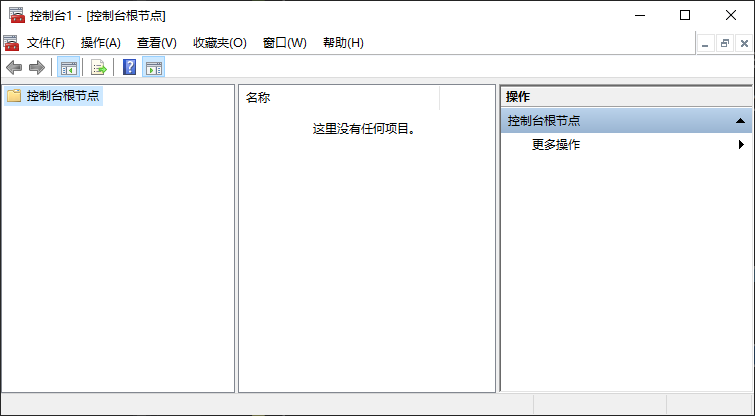
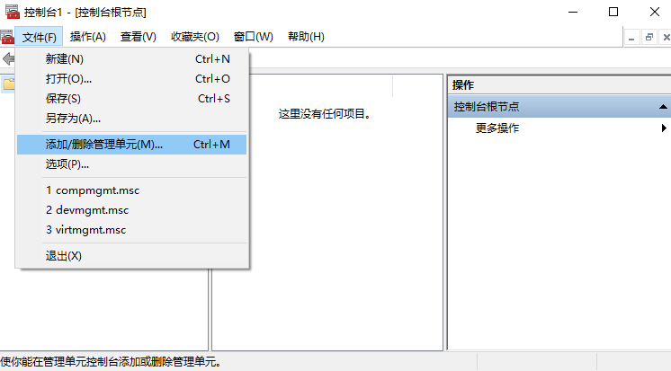
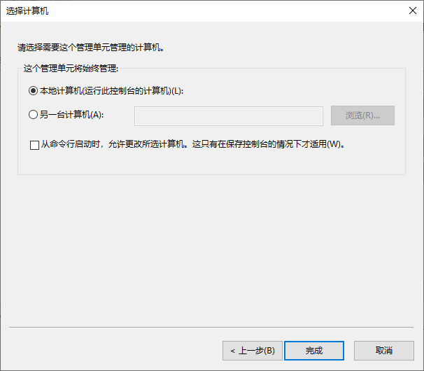
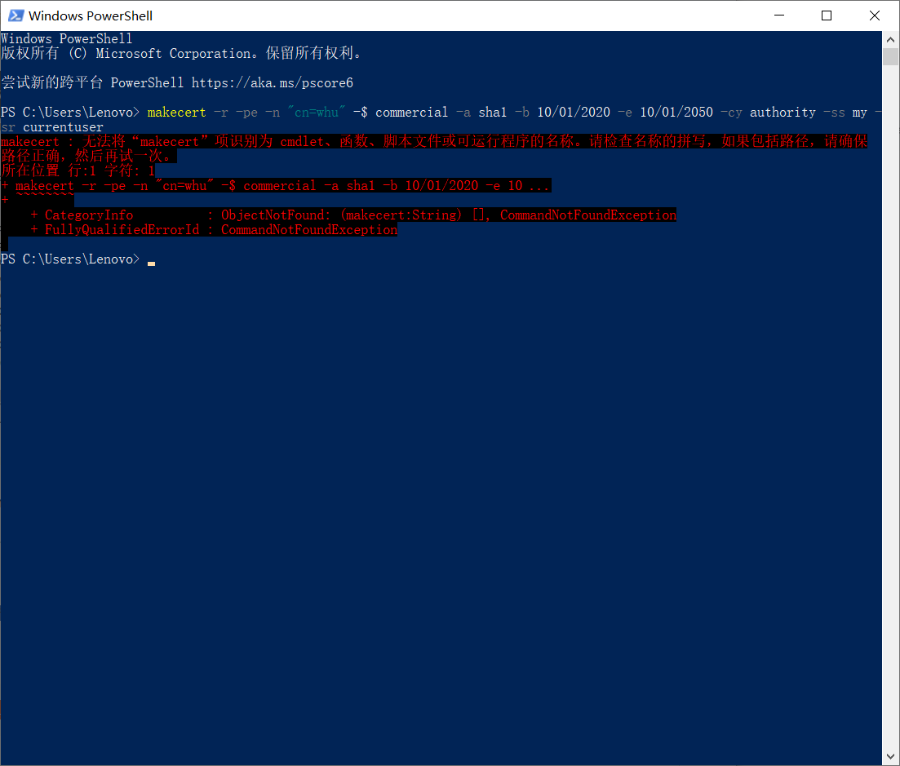
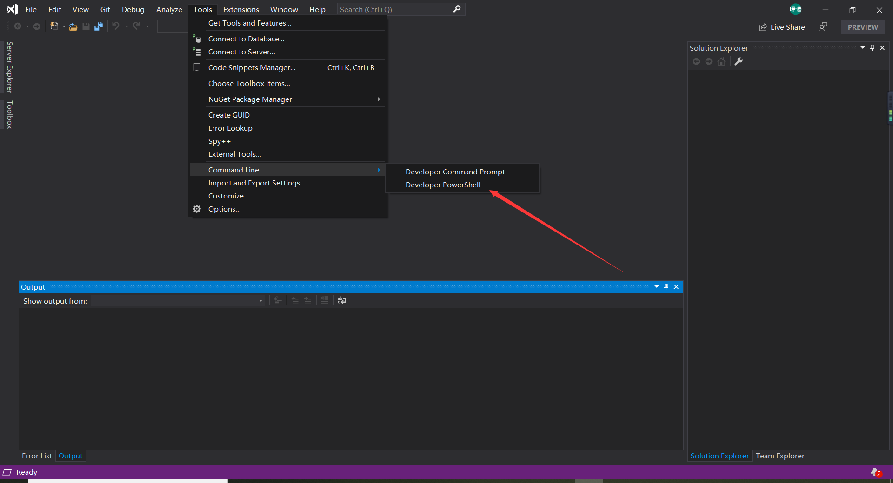
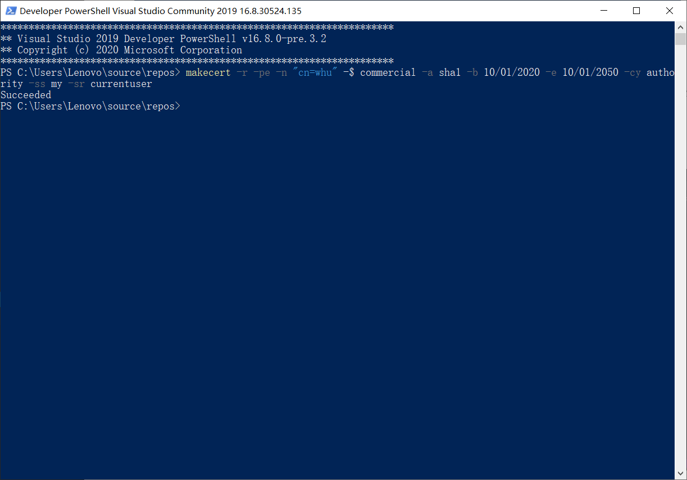
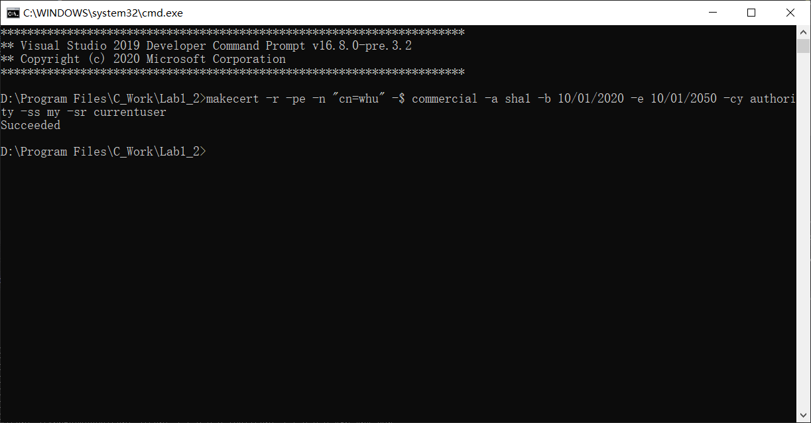

# View certificates with the MMC snap-in

[How to: View certificates with the MMC snap-in](https://docs.microsoft.com/en-us/dotnet/framework/wcf/feature-details/how-to-view-certificates-with-the-mmc-snap-in)

[How to: Create Temporary Certificates for Use During Development](https://docs.microsoft.com/en-us/dotnet/framework/wcf/feature-details/how-to-create-temporary-certificates-for-use-during-development)

***

The following procedure demonstrates how to examine the stores on your 
local device to find an appropriate certificate:

1. Shortcuts win + R, and then enter mmc.

The MMC (Microsoft Management Console) appears.




2. From the File menu, select Add/Remove Snap In (添加/删除 管理单元).

The Add or Remove Snap-ins window appears.




3. From the Available snap-ins list, choose Certificates, then select Add.


4. In the Certificates snap-in window, select Computer account, and then 
select Next.


Optionally, you can select My user account for the current user or Service 
account for a particular service.

5. In the Select Computer window, leave Local computer selected, and then select Finish.



6. In the Add or Remove Snap-in window, select OK.


Optional: From the File menu, select Save or Save As to save the MMC console file for later use.

7. To view your certificates in the MMC snap-in, select Console Root in the 
left pane, then expand Certificates (Local Computer).

8. A list of directories for each type of certificate appears. From each 
certificate directory, you can view, export, import, and delete its 
certificates.

我们需要生成证书, 并将其添加到“受信任的根证书颁发机构”供应用程序的安装调试使用。

打开 powershell
```shell
makecert -r -pe -n "cn=whu" -$ commercial -a sha1 -b 10/01/2020 -e 10/01/2050 -cy authority -ss my -sr currentuser
```

**Solution to makecert error in windows powershell:**

An error will occur as shown in the figure if you run the command above in windows powershell.



You can solve this error easily by running this command in VS `Developer Powershell` or `Developer Command Prompt`

You can find the VS `Developer Powershell` and `Developer Command Prompt` in VS Tools->Command Line



Then you can run the makecert command successfully using the `Developer Powershell` or `Developer Command Prompt`





# View certificates with the Certificate Manager tool

You can also view, export, import, and delete certificates by using the Certificate Manager tool.

## To view certificates for the local device
1. Select Run from the Start menu, and then enter **certlm.msc**.

The Certificate Manager tool for the local device appears.

2. To view your certificates, under Certificates - Local Computer in the 
left pane, expand the directory for the type of certificate you want to 
view.

## To view certificates for the current user
1. Select Run from the Start menu, and then enter **certmgr.msc**.

The Certificate Manager tool for the current user appears.

2. To view your certificates, under Certificates - Current User in the 
left pane, expand the directory for the type of certificate you want to 
view.


