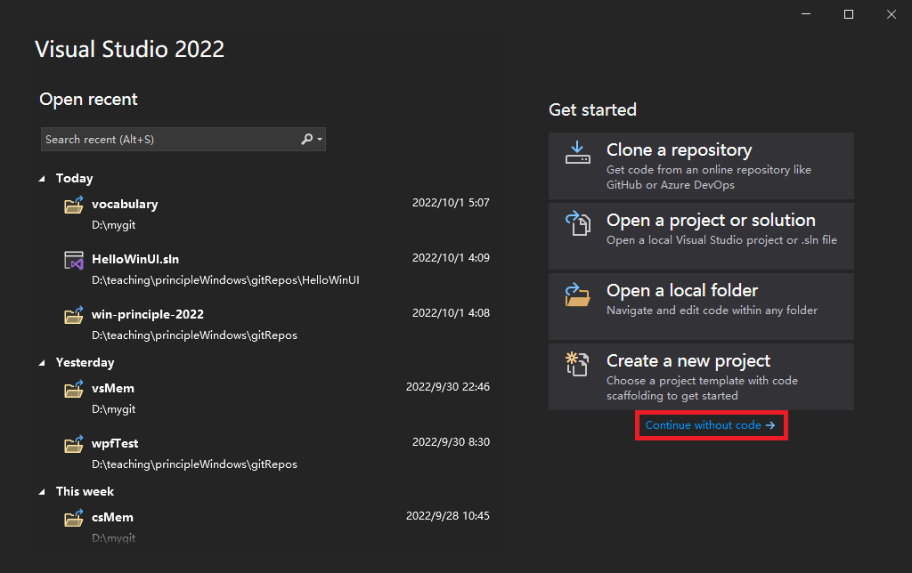
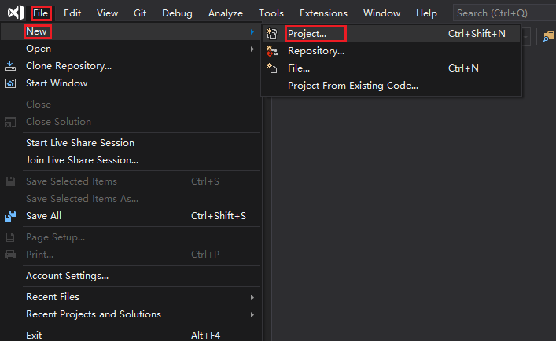
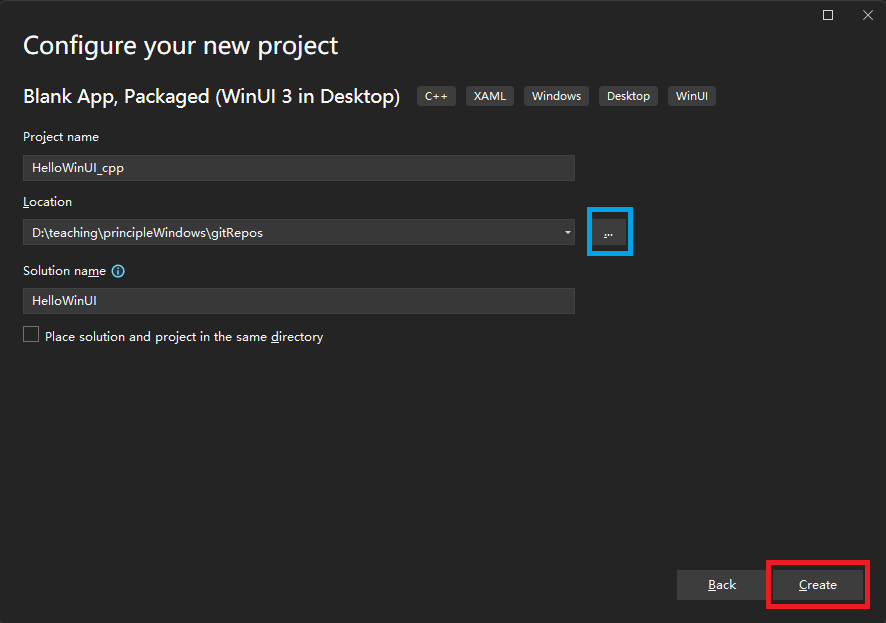
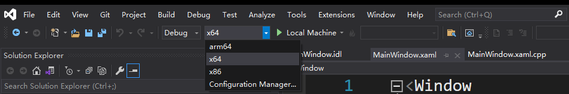
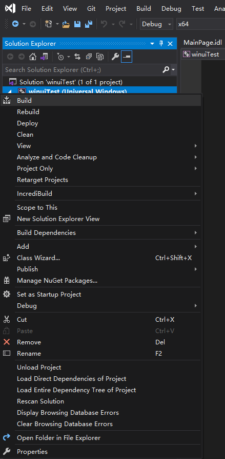
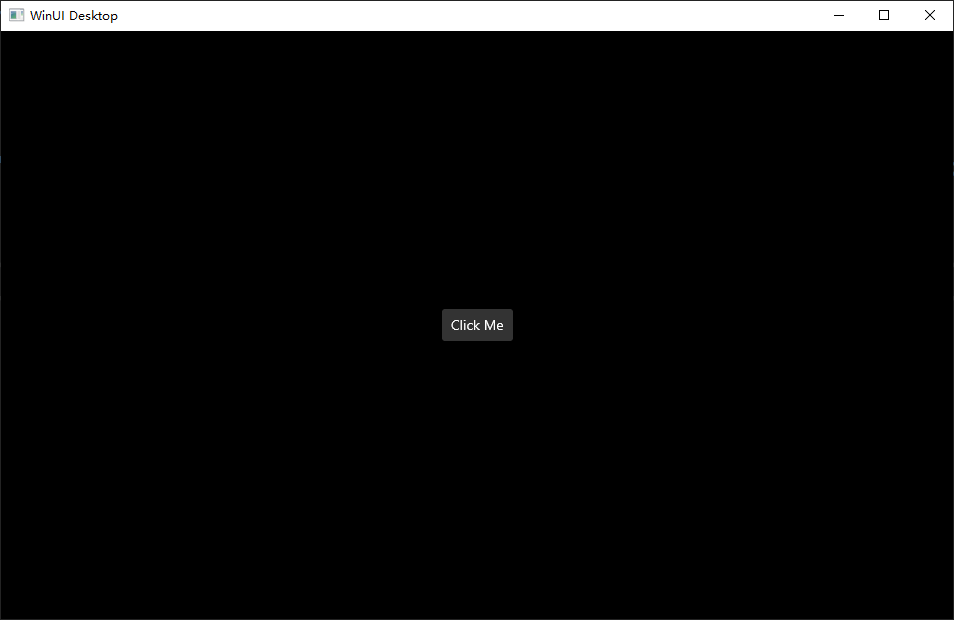

# Create blank windows applications

- <https://learn.microsoft.com/en-us/windows/apps/winui/winui3/create-your-first-winui3-app>
- <https://docs.microsoft.com/en-us/windows/uwp/cpp-and-winrt-apis/simple-winui-example>

***

In this experiment we are going to create several types of blank desktop applications on 
the Windows 11 platform:
- a blank C# / WinUI 3 desktop application
- a blank C++ / WinUI 3 desktop application
- a blank python application


## 0 Experiment requirements of software environment


## 1 Steps to create a C++/WinUI3 application

1. Download and run the latest *installer* for the Windows App SDK from [Downloads for the Windows 
App SDK](https://learn.microsoft.com/en-us/windows/apps/windows-app-sdk/downloads).

2. Install the [Microsoft Visual C++ Redistributable (VCRedist)](https://learn.microsoft.com/en-us/cpp/windows/latest-supported-vc-redist) 
appropriate for the architecture of the target device.
> If you don't have the VCRedist installed on the target device, then dynamic links to 
`c:\windows\system32\vcruntime140.dll` fail.

3. In Visual Studio, select File > New > Project.

4. In the New Project dialog's drop-down filters, select C++, Windows, and WinUI, respectively.

5. You need to start with an MSIX-packaged project in order to use XAML diagnostics. So select 
the **Blank App, Packaged (WinUI 3 in Desktop)** project template, and click Next.

6. Add the following two properties to your project file with extension .vcxproj. Put it inside the 
PropertyGroup element that's already there:
```xml
<Project ...>
  ...
  <PropertyGroup Label="Globals">
    ...
    <WindowsPackageType>None</WindowsPackageType>
    <AppxPackage>false</AppxPackage>
    ...
  </PropertyGroup> 
  ...
</Project>
```

7. Build and run.
 


## 2 Steps to create a C#/WinUI3 application

Steps 1 through 3 are just the same as in the previous section. 

4. In the New Project dialog's drop-down filters, select C#, Windows, and WinUI, respectively.

Step 5 is the same as the one in the previous section

6. Add the following property to your project file with extension .csproj. Put it inside the 
PropertyGroup element that's already there:
```xml
<Project ...>
  ...
  <PropertyGroup>
    ...
    <WindowsPackageType>None</WindowsPackageType>
  </PropertyGroup> 
  ...
</Project>
```

7. To start a C# app from Visual Studio (either Debugging or Without Debugging), select the 
Unpackaged launch profile from the Start drop-down. If the Package profile is selected, then 
you'll see a deployment error in Visual Studio. This step isn't necessary if you start the 
application (.exe) from the command line or from Windows File Explorer.


8. Build and run.


本文介绍如何在 VS 中生成一个空的应用程序。下面以 Visual Studio 2019 Preview Community
为例子介绍整个过程, VS 2017 和 VS 2019 的其它版本可参考进行。

1. 打开 Visual Studio 2019 Community (点击 continue without codes)(或者直接点击Create a new project跳到第三步)



2. 点击 File -> new -> Project



3. 在 Create a new project 对话框的右上下拉选择菜单种分别选择 [c++], 
[Windows], [WinUI], 再在出现的项目类型中选择 "App (WinUI 3 in Desktop)"
后点击 Next


上面的应用程序类型可根据需要选择其它项目类型。

4. 填写欲创建的工程名称、存放位置及解决方案名称后点击 Create 按钮



5. 选择缺省的参数后点击 Create


6. 然后等待...


7. 最终生成应用程序工程


8. 选择 active solution platform 为 x64



9. 右键点击项目名称后在弹出的菜单里选择 build 开始生成该项目的应用



10. 按快捷键 F5 可调试运行该程序



第一次运行会比较慢，请耐心等待。

