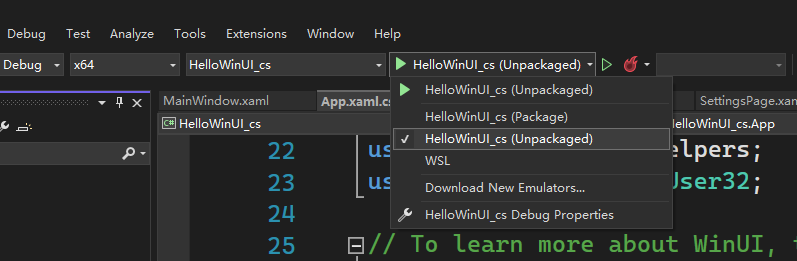

# Lab 2: Create windows applications

转到 [中文版](lab_1_2_cn.md)

**refs:**
- <https://learn.microsoft.com/en-us/windows/apps/winui/winui3/create-your-first-winui3-app>
- <https://docs.microsoft.com/en-us/windows/uwp/cpp-and-winrt-apis/simple-winui-example>
- <https://learn.microsoft.com/en-us/visualstudio/python/tutorial-working-with-python-in-visual-studio-step-00-installation>

***

In this experiment we are going to create several types of desktop applications on 
the Windows 11 platform, by using Visual Studio Community 2022 64-bit version:
- a C# / WinUI 3 desktop application
- a C++ / WinUI 3 desktop application
- a python application

## Index

0. [Prerequisites](#prerequisites)
1. [Create a C++/WinUI3 application](#create_cpp_winui3_app)
2. [Create a C#/WinUI3 application](#create_cs_winui3_app)
3. [Create a Python project](#create_python_proj)\
    [3.0 Install Python support](#3_0_install_python_support)\
    [3.1 Create a new Python project](#3_1_create_new_python_project)\
    [3.2 Write and run](#3_2_write_and_run_code)


## 0 Prerequisites

1. Download and run the latest *installer* for the Windows App SDK from [Downloads for the Windows 
App SDK](https://learn.microsoft.com/en-us/windows/apps/windows-app-sdk/downloads).

2. Install the [Microsoft Visual C++ Redistributable (VCRedist)](https://learn.microsoft.com/en-us/cpp/windows/latest-supported-vc-redist) 
appropriate for the architecture of the target device.
> If you don't have the VCRedist installed on the target device, then dynamic links to 
`c:\windows\system32\vcruntime140.dll` fail.

[Back to index](#index)


## 1 Create a C++/WinUI3 application <span id="create_cpp_winui3_app"></span>

1. In Visual Studio, select File > New > Project.

2. In the New Project dialog's drop-down filters, select C++, Windows, and WinUI, respectively.

3. You need to start with an MSIX-packaged project in order to use XAML diagnostics. So select 
the **Blank App, Packaged (WinUI 3 in Desktop)** project template, and click Next.

4. Add the following two properties to your project file with extension .vcxproj. Put it inside the 
PropertyGroup element that's already there:
```xml
<Project ...>
  ...
  <PropertyGroup Label="Globals">
    ...
    <WindowsPackageType>None</WindowsPackageType>
    <AppxPackage>false</AppxPackage>
    ...
  </PropertyGroup> 
  ...
</Project>
```

5. Build and run.

[Back to index](#index)


## 2 Create a C#/WinUI3 application <span id="create_cs_winui3_app"></span>

Steps 1 is just the same as in the previous section. 

2. In the New Project dialog's drop-down filters, select C#, Windows, and WinUI, respectively.

Step 3 is the same as the one in the previous section

4. Add the following property to your project file with extension .csproj. Put it inside the 
PropertyGroup element that's already there:
```xml
<Project ...>
  ...
  <PropertyGroup>
    ...
    <WindowsPackageType>None</WindowsPackageType>
  </PropertyGroup> 
  ...
</Project>
```

5. To start a C# app from Visual Studio (either Debugging or Without Debugging), select the 
Unpackaged launch profile from the Start drop-down. If the Package profile is selected, then 
you'll see a deployment error in Visual Studio. This step isn't necessary if you start the 
application (.exe) from the command line or from Windows File Explorer.



6. Build and run.

[Back to index](#index)


## 3. Create a Python project <span id="create_python_proj"></span>


### 3.0 Install Python support <span id="3_0_install_python_support"></span>

1. Open Visual Studio and run the installer by selecting `Tools` > `Get Tools and Features`.

2. Select the `Python development workload` and select **Install**

3. To quickly test Python support, launch Visual Studio, press Alt+I to open the Python 
Interactive window, and enter `2+2`. If you don't see the output of 4, recheck your steps.

[Back to index](#index)


### 3.1 Create a new Python project <span id="3_1_create_new_python_project"></span>

1. In Visual Studio, select `File` > `New` > `Project` or press `Ctrl+Shift+N`. The Create a 
new project screen displays, where you can search and browse templates across different languages.

2. In the New Project dialog's drop-down filters, select Python language.


3. Select the Python Application, and select `Next`.

4. On the `Configure your new project` screen, specify a name and file location for the project, 
and then select **Create**.

[Back to index](#index)


### 3.2 Coding and run <span id="3_2_write_and_run_code"></span>

1. The empty file `HelloWorld_python.py` created above will be automatically opened
in an editor window in Visual Studio.

2. In the editor window，input: print("Hello, World!")

3. Press shortcuts key `F5` or `Ctrl+F5`，or choose the menu item `Debug` > `Start Debugging` 
or `Start without Debugging`，
运行上面所编写的代码。 如果代码中存在错误，Visual Studio 会发出警告。

4. 控制台窗口将显示结果
```shell
Hello, World!
Press any key to continue . . .
```

[Back to index](#index)

