# 实验二: 创建 windows 应用程序

go to [English Version](lab_1_2.md)

**参考:**
- <https://learn.microsoft.com/en-us/windows/apps/winui/winui3/create-your-first-winui3-app>
- <https://docs.microsoft.com/en-us/windows/uwp/cpp-and-winrt-apis/simple-winui-example>
- <https://learn.microsoft.com/en-us/visualstudio/python/tutorial-working-with-python-in-visual-studio-step-00-installation>

***

在此次实验中，我们将使用 Visual Studio 2022 的64位社区版来创建 Windows 11 
平台下几种不同类型的桌面应用程序，包括：
- C++ / WinUI 3 桌面应用程序
- C# / WinUI 3 桌面应用程序
- python 应用程序


## 目录 <span id="index"></span>

0. [实验前准备工作](#prerequisites)
1. [创建 C++/WinUI3 应用程序](#create_cpp_winui3_app)
2. [创建 C#/WinUI3 应用程序](#create_cs_winui3_app)
3. [创建 Python 工程项目](#create_python_proj)\
    [3.0 安装 Python 开发支持](#3_0_install_python_support)\
    [3.1 创建新的 Python 工程项目](#3_1_create_new_python_project)\
    [3.2 编码并运行](#3_2_write_and_run_code)


## 0 实验前准备工作 <span id="prerequisites"></span>

1. 安装 Visual Studio Community 2022, 选择界面语言为英语，并将 Tools > 
options > Environment > General > Color Theme 设置为 Dark

2. 从网站 [Downloads for the Windows App SDK](https://learn.microsoft.com/en-us/windows/apps/windows-app-sdk/downloads)
下载并运行最新版的 Windows App SDK **安装程序**。

3. 为目标设备（这里是你进行实验的计算机）安装 [Microsoft Visual C++ Redistributable (VCRedist)](https://learn.microsoft.com/en-us/cpp/windows/latest-supported-vc-redist)。
> 如果未给目标设备安装该 VCRedist 分发，将会导致在运行实验的目标代码时产生无法连接到动态链接库
`c:\windows\system32\vcruntime140.dll` 的错误。

[回到目录](#index)


## 1 创建 C++/WinUI3 应用程序 <span id="create_cpp_winui3_app"></span>

1. 打开 Visual Studio 2022 Community (点击 continue without codes)
(或者直接点击Create a new project跳到第三步)

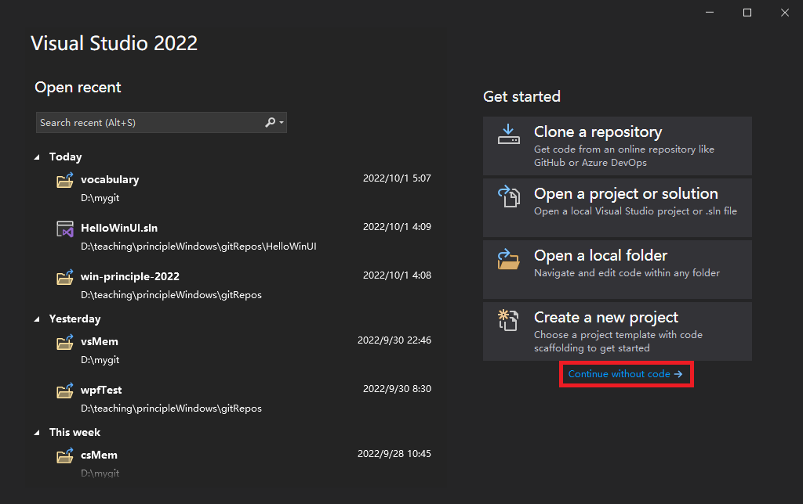

2. 在 Visual Studio 中菜单中选取 File > New > Project。

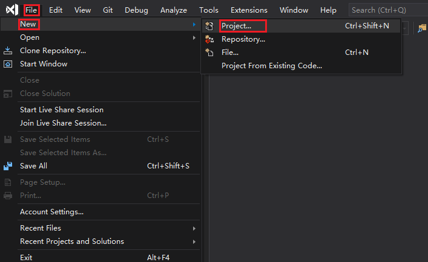

3. 在 Create a new project 对话框的右上方的下拉选择菜单中分别选择 [c++], 
[Windows], [WinUI]

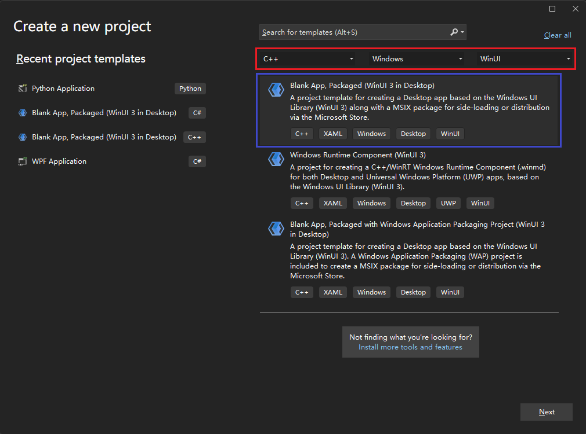

4. 为了能使能 XAML 诊断需要启用 MSIX-packaged 工程项目（后续再修改），因此我们
在出现的项目类型中选择 **Blank App, Packaged (WinUI 3 in Desktop)** 
工程项目模板, 然后点击 `Next`。
\
上面的应用程序类型可根据需要选择其它项目类型。

5. 填写欲创建的工程名称、存放位置及解决方案名称后点击 Create 按钮

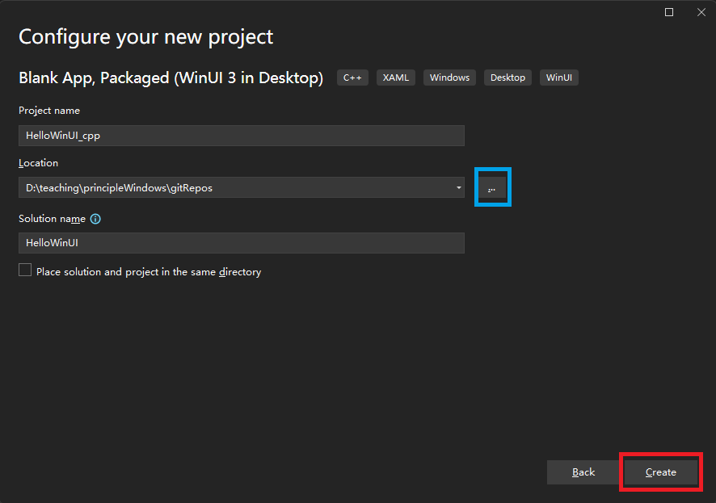

6. 然后等待...

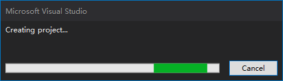

7. 最终生成应用程序工程

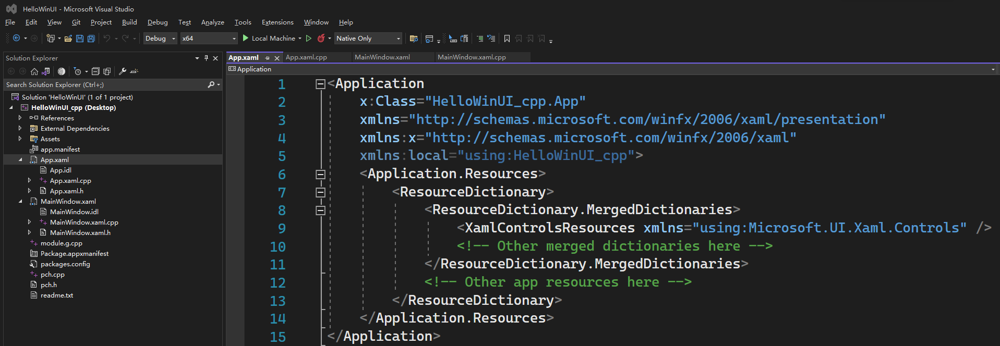

8. 选择 active solution platform 为 x64

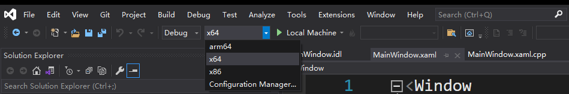

9. 在 `Solution Explorer` 中右键点击工程项目名称 `HelloWinUI_cpp` 弹出菜单中选择
`Unload Project`, 这样就会关闭当前所有编辑文档的窗口。

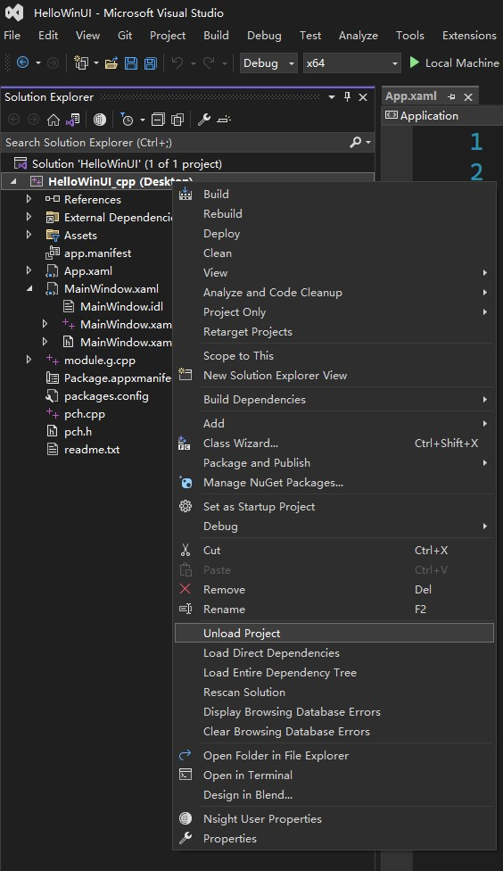

再右击工程项目名称 `HelloWinUI_cpp` 弹出菜单中选择 `Edit Project File` 我们就可以修改项目的工程文件

10. 将下述两项属性加到扩展名为 HelloWinUI_cpp.vcxproj 的项目工程文件中。放入已有的 PropertyGroup 
元素中:
```xml
<Project ...>
  ...
  <PropertyGroup Label="Globals">
    ...
    <WindowsPackageType>None</WindowsPackageType>
    <AppxPackage>false</AppxPackage>
    ...
  </PropertyGroup> 
  ...
</Project>
```
其中原来的
```xml
    <AppxPackage>true</AppxPackage>
```
中的 `true` 需要被改成 `false`。

11. 右键点击项目名称后在弹出的菜单里选择 build 开始生成该项目的应用

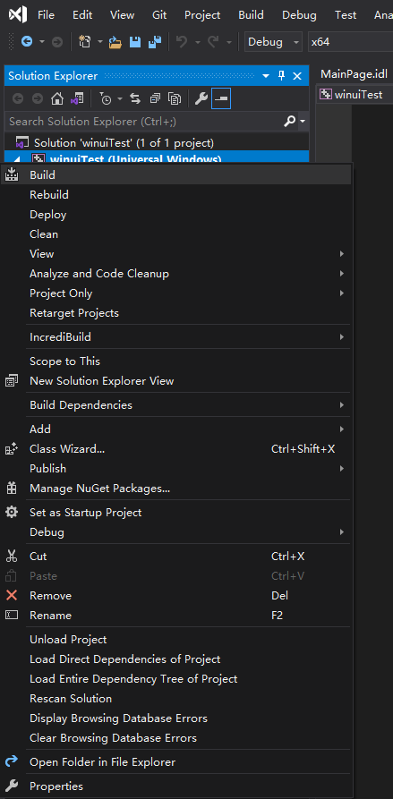

12. 按快捷键 F5 可调试运行该程序

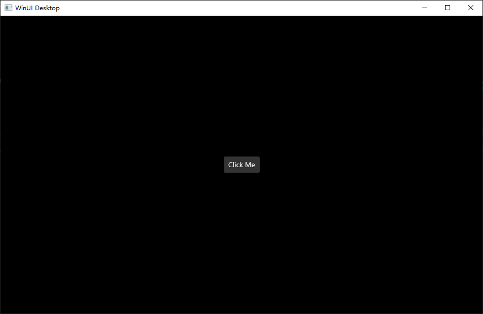

第一次运行会比较慢，请耐心等待。

> 上面的步骤 9 与步骤 10 是手工修改的方法，随着 VS 对 App SDK 支持的完善，未来这两步会不需要手工进行。

[回到目录](#index)


## 2 创建 C#/WinUI3 应用程序 <span id="create_cs_winui3_app"></span>

1. 在 Visual Studio 中菜单中选取 File > New > Project。

2. 在出现的新建工程项目对话框的下拉过滤列表项中分别选择 C#, Windows, 与 WinUI 选项。

3. 与前一节类似的步骤创建工程项目 `HelloWinUI_cs`, 并加入到前面创建的 Solution `HelloWinUI` 中。

4. 将下述两项属性加到扩展名为 .csproj 的工程项目文件中。放入已有的 PropertyGroup 
元素中:
```xml
<Project ...>
  ...
  <PropertyGroup>
    ...
    <WindowsPackageType>None</WindowsPackageType>
  </PropertyGroup> 
  ...
</Project>
```

5. （无论是以 debugging 方式或以 without debugging 方式）来启动一个 C# 应用程序，要从启动下拉菜单中
选取 unpackaged 加载配置文件。如果选取 Package 配置文件，则会在 Visual Studio 中出现部署错误。
如果你通过命令行或者 Windows 文件浏览器来启动应用程序 (.exe) 则这一步可以省略。

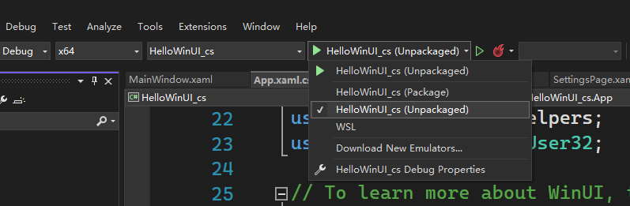

6. 生成项目并运行。

[回到目录](#index)


## 3. 创建 Python 工程项目 <span id="create_python_proj"></span>


### 3.0 安装 Python 开发支持 <span id="3_0_install_python_support"></span>

1. 打开 Visual Studio 在菜单中选取 `Tools` > `Get Tools and Features` 来运行安装 VS。

2. 选择 `Python 开发工作负载` 并点击 **安装**

3. 如果要快速测试 Python 支持, 加载 Visual Studio, 按键 Alt+I 打开 Python 
交互窗口, 输入 `2+2` 后回车. 如果没有见到输出为 4, 则需要重新检查安装步骤是否完整。

[回到目录](#index)


### 3.1 创建新的 Python 工程项目 <span id="3_1_create_new_python_project"></span>

1. 运行 Visual Studio, 选择 `File` > `New` > `Project` 或者按快捷键 `Ctrl+Shift+N` 
调出创建新工程项目的屏幕显示，这里可以搜索浏览不同的模板及不同的编程语言选择。

2. 在新建工程项目的下拉菜单过滤选项中，选择 Python 语言。
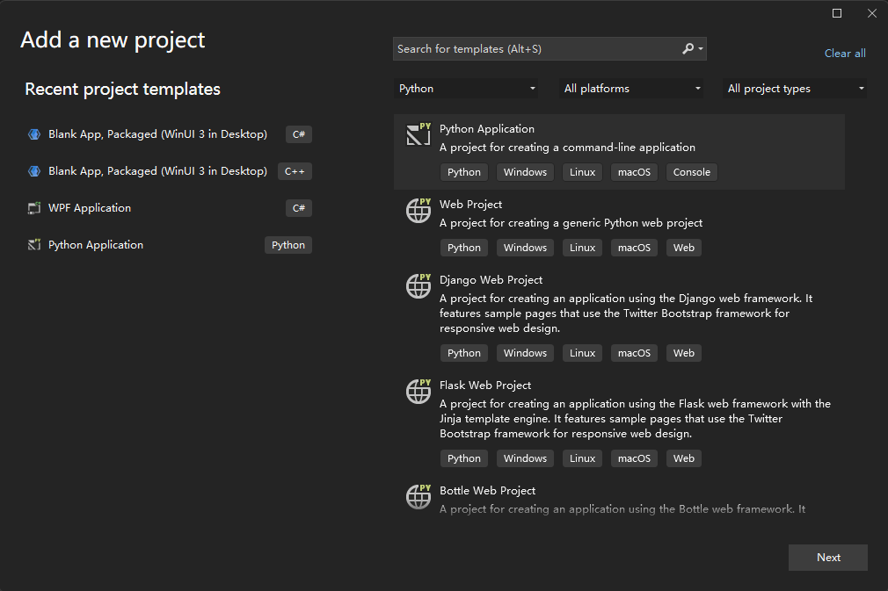

3. 选择 Python 应用，然后点击 `Next`。

4. 在 `Configure your new project` 屏显中，设定工程项目的名称及文件位置，
并点击 **Create**。
\
上面所创建的新项目 HelloWorld_python 将在 Visual Studio 中打开。
    - Visual Studio 的“解决方案资源管理器”窗口将显示项目结构 (1) 。
    - 默认代码文件将在编辑器中打开 (2)。
    - “属性”窗口将显示在“解决方案资源管理器”中选择的项的其他信息，包括它在磁盘上的确切位置 (3) 。

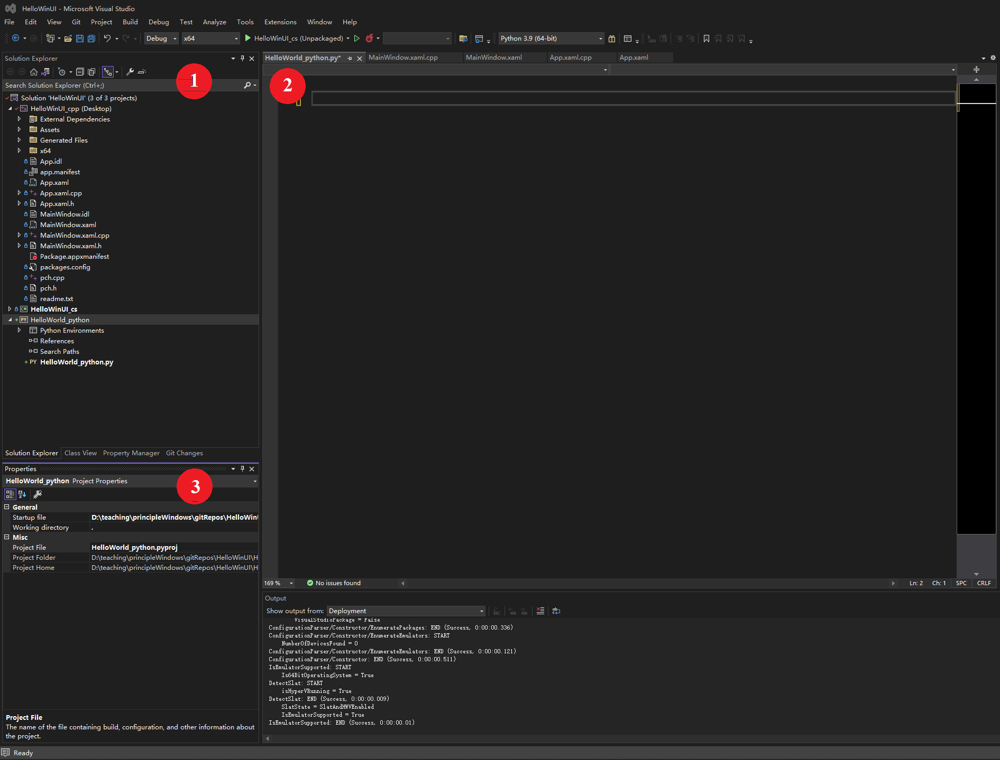

[回到目录](#index)


### 3.2 编码并运行 <span id="3_2_write_and_run_code"></span>

1. 上面所创建的空文件 `HelloWorld_python.py` 会自动在 Visual Studio 编辑器中打开。

2. 在编辑器中，键入 print("Hello, World!")

3. 快捷键 `F5` 或 `Ctrl+F5`，也可以选择 `Debug` > `Start Debugging` 或 `Start without Debugging` 菜单项，
运行上面所编写的代码。 如果代码中存在错误，Visual Studio 会发出警告。

4. 控制台窗口将显示结果
```shell
Hello, World!
Press any key to continue . . .
```

[回到目录](#index)


