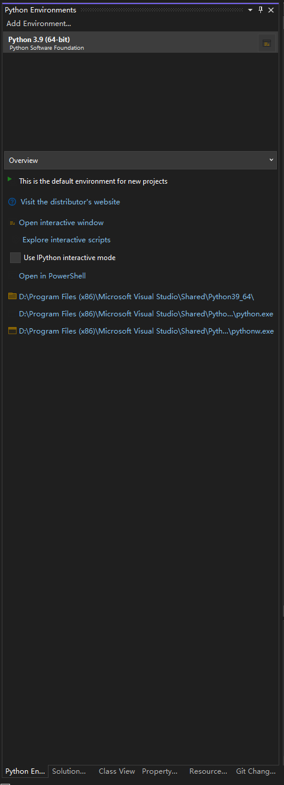

# Python environments

- [How to create and manage Python environments in Visual Studio](https://docs.microsoft.com/en-us/visualstudio/python/managing-python-environments-in-visual-studio)

*****************************

## Index

1. [The Python Environments window](#the-python-environments-window) \
   [0.1 安装](#installation) \
   [0.2 dist-packages和site-packages区别](#dist_n_site)
2. [Manually identify an existing environment](#manually-identify-an-existing-environment) \
   [1.1 Creating Package](#Creating-Package) \
   [1.2 Understanding `__init__.py`](#Understanding) \
   [1.3 Import Modules from a Package](#Import-Modules-from-a-Package)
3. [Fix or delete invalid environments](#fix-or-delete-invalid-environments) \
   [2.1 创建发布](#create-setup) \
   [2.2 安装发布](#install-setup)
4. [Modify the registry to correct an environment that doesn't have a repair option, or to remove an invalid environment](#modify-the-registry-to-correct-an-environment)

A Python environment is a context in which you run Python code and includes global, virtual, and 
conda environments. An environment consists of an interpreter, a library (typically the Python 
Standard Library), and a set of installed packages. These components together determine valid 
language constructs and syntax, operating-system functionality that you can access, and packages 
you can use.

In Visual Studio on Windows, you use the Python Environments window, as described in this article, 
to manage environments and select one as the default for new projects. Other aspects of environments 
are found in the following articles:

- For any given project, you can 
[select a specific environment](https://docs.microsoft.com/en-us/visualstudio/python/selecting-a-python-environment-for-a-project) 
rather than use the default.

- For details on creating and using virtual environments for Python projects, see 
[Use virtual environments](https://docs.microsoft.com/en-us/visualstudio/python/selecting-a-python-environment-for-a-project?view=vs-2022#use-virtual-environments).

- If you want to install packages in an environment, refer to the 
[Packages tab reference](https://docs.microsoft.com/en-us/visualstudio/python/python-environments-window-tab-reference?view=vs-2022#packages-tab).

- To install another Python interpreter, see 
[Install Python interpreters](https://docs.microsoft.com/en-us/visualstudio/python/installing-python-interpreters?view=vs-2022). 
In general, if you download and run an installer for a mainline Python distribution, Visual Studio 
detects that new installation and the environment appears in the Python Environments window and can 
be selected for projects.

If you're new to Python in Visual Studio, the following articles also provide from general background:
- [Work with Python in Visual Studio](https://docs.microsoft.com/en-us/visualstudio/python/overview-of-python-tools-for-visual-studio?view=vs-2022)
- [Install Python support in Visual Studio](https://docs.microsoft.com/en-us/visualstudio/python/installing-python-support-in-visual-studio?view=vs-2022)

> **Note** \
You can manage environments for Python code that is opened as a folder using the `File > Open > Folder` 
command. The Python toolbar allows you switch between all detected environments, and also add a new 
environment. The environment information is stored in the PythonSettings.json file in the Workspace `.vs` 
folder.

[Back to index](#index)

## 1 The Python Environments window
---------------

The environments that Visual Studio knows about are displayed in the Python Environments window. To 
open the window, use one of the following methods:
- Select the `View > Other Windows > Python Environments` menu command.
- Right-click the `Python Environments` node for a project in `Solution Explorer` and select `View All 
Python Environments`.

In all these cases, the Python Environments window appears alongside Solution Explorer: \

Visual Studio looks for installed global environments using the registry (following 
[PEP 514](https://www.python.org/dev/peps/pep-0514/)), along with virtual environments and conda 
environments (see [Types of environments](https://docs.microsoft.com/en-us/visualstudio/python/managing-python-environments-in-visual-studio?view=vs-2022#types-of-environments)). 
If you don't see an expected environment in the list, see 
[Manually identify an existing environment](https://docs.microsoft.com/en-us/visualstudio/python/managing-python-environments-in-visual-studio?view=vs-2022#manually-identify-an-existing-environment).

When you select an environment in the list, Visual Studio displays various properties and commands 
for that environment on the Overview tab.

For example, you can see in the image above that the interpreter's location is 
`D:\Program Files (x86)\Microsoft Visual Studio\Shared\Python39_64`. The four commands at the bottom 
of the Overview tab each open a command prompt with the interpreter running. For more information, see 
[Python Environments window tab reference 2022- Overview](https://docs.microsoft.com/en-us/visualstudio/python/python-environments-window-tab-reference?view=vs-2022#overview-tab).

Use the drop-down list below the list of environments to switch to different tabs such as Packages, 
and IntelliSense. These tabs are also described in the 
[Python Environments window tab reference](https://docs.microsoft.com/en-us/visualstudio/python/python-environments-window-tab-reference?view=vs-2022).

Selecting an environment doesn't change its relation to any projects. The default environment, 
shown in boldface in the list, is the one that Visual Studio uses for any new projects. To use a 
different environment with new projects, use the `Make this the default environment for new projects` 
command. Within the context of a project, you can always select a specific environment. For more 
information, see [Select an environment for a project](https://docs.microsoft.com/en-us/visualstudio/python/selecting-a-python-environment-for-a-project?view=vs-2022).

To the right of each listed environment, is a control that opens an Interactive window for that 
environment. 

> **Note**\
Although Visual Studio respects the system-site-packages option, it doesn't provide a way to 
change it from within Visual Studio.

[Back to index](#index)

## 2 Manually identify an existing environment
---------------

[Back to index](#index)

## 3 Fix or delete invalid environments
---------------

[Back to index](#index)

## 4 Modify the registry to correct an environment that doesn't have a repair option, or to remove an invalid environment

---------------

