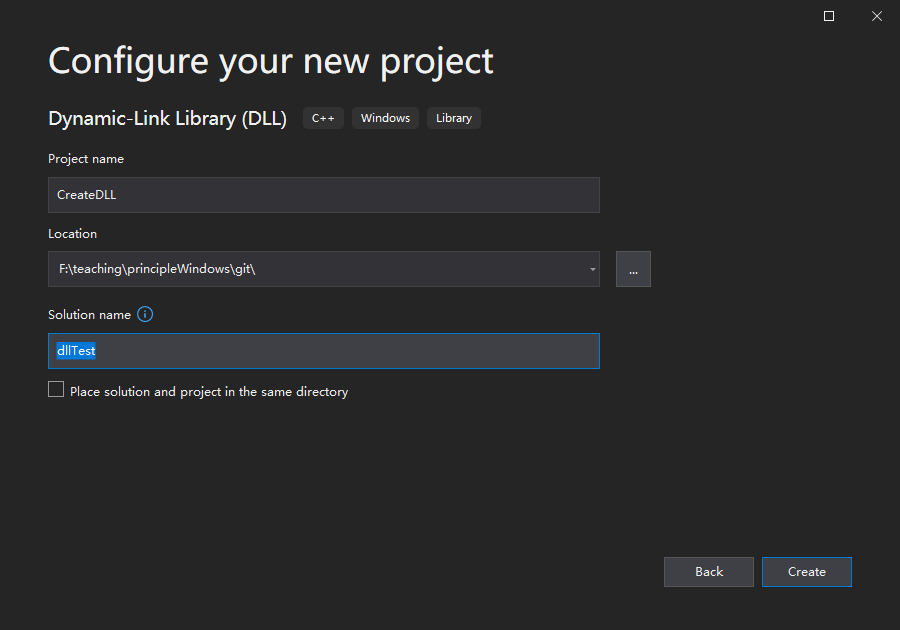
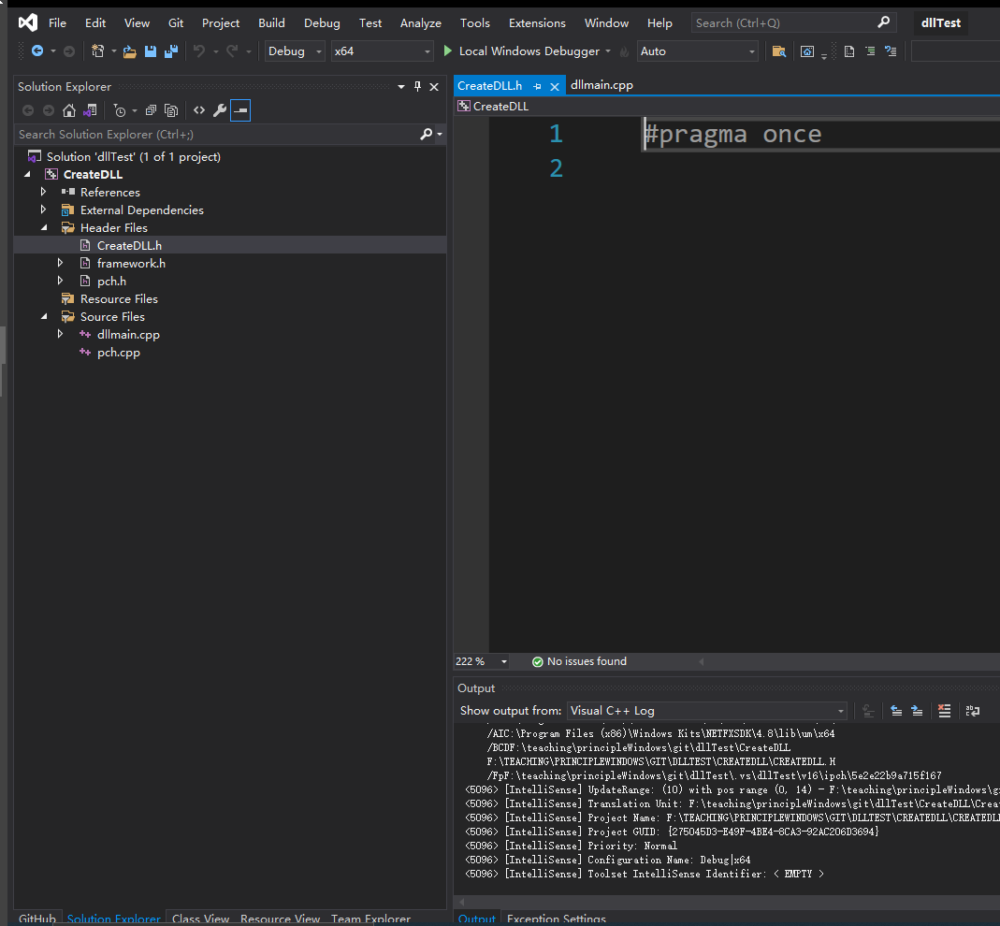
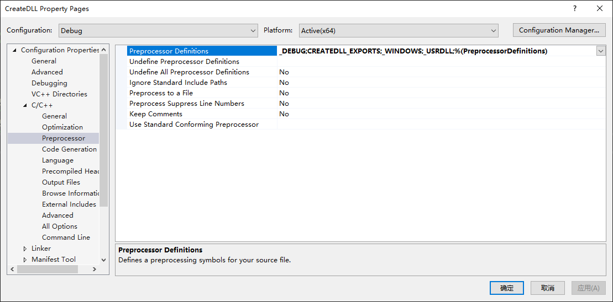
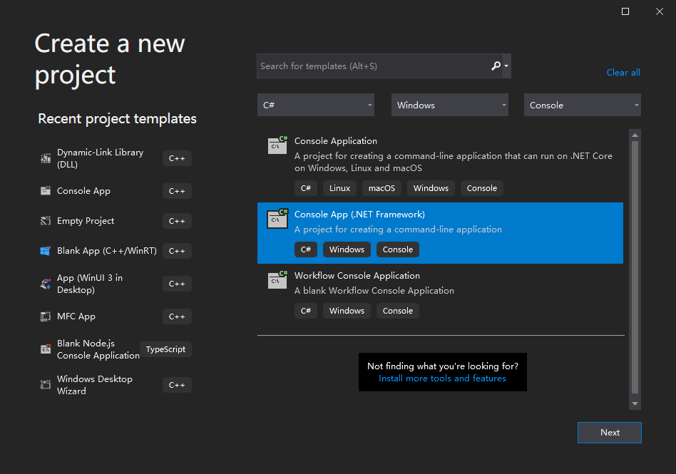
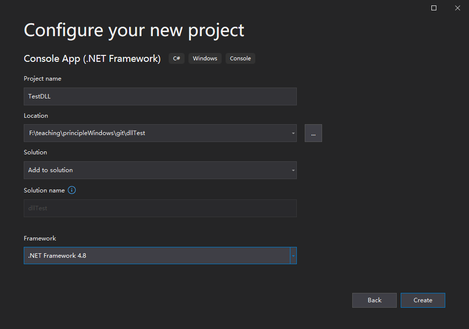
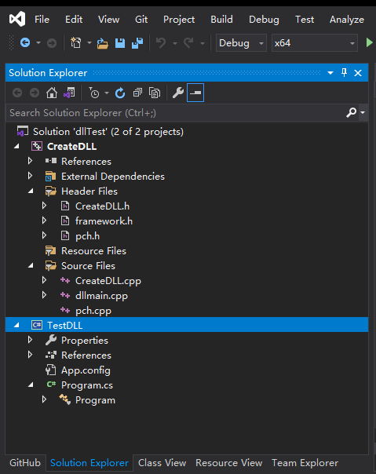
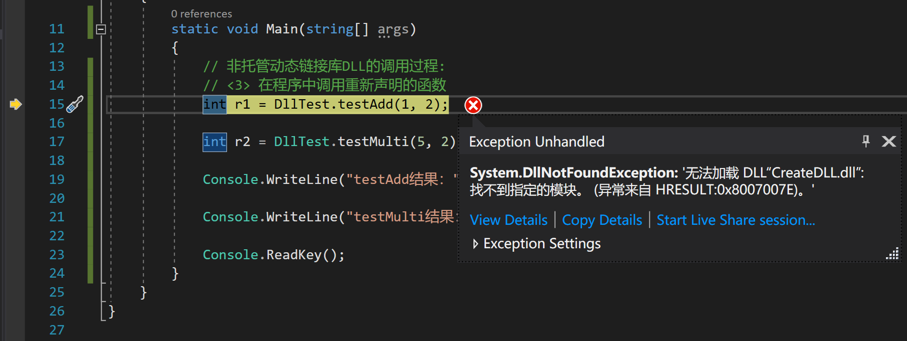
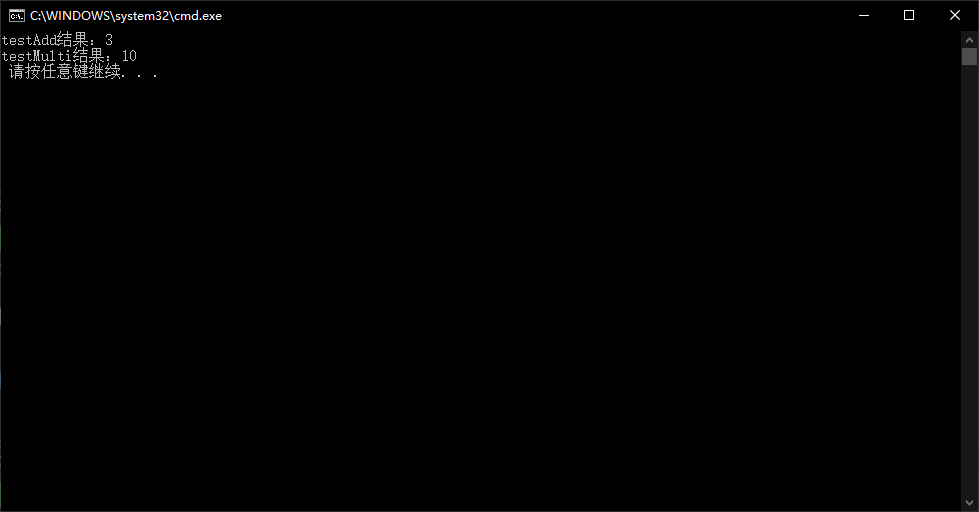

# 3.1 Create Unmanaged Dynamic Link Library

This walkthrough experiement is adapted from:
* [ref 1](https://docs.microsoft.com/en-us/cpp/build/walkthrough-creating-and-using-a-dynamic-link-library-cpp)
* [ref 2](https://www.cnblogs.com/94cool/p/5772376.html)

***

## PART ONE: Create the C++ unmanaged DLL

In this set of experiements, we will create a project for the C++ unmanaged DLL, 
add code, and build it. To begin, start the Visual Studio 2019 and sign in 
with your WHU university accademic account. The procedures vary slightly depending on which 
version of Visual Studio you're using. 

### 1.1 To create a DLL project in Visual Studio 2019

1. On the menu bar, choose File > New > Project to open the Create a New Project dialog box.


2. At the top of the dialog, set Language to C++, set Platform to Windows, 
and set Project type to Library.

3. From the filtered list of project types, select Dynamic-link Library (DLL), 
and then choose Next.

4. In the Configure your new project page, enter `CreateDLL` in the Project name box to 
specify a name for the project. Choose the default Location and set the Solution name to be
`dllTest`. Uncheck Place solution and project in the same directory if it's checked.



5. Choose the Create button to create the solution and the project.

When the solution is created, you can see the generated project and source files in 
the `Solution Explorer` window in Visual Studio.


Right now, this DLL doesn't do very much. Next, you'll create a header file to declare 
the functions the DLL exports, and then add the function definitions to the DLL to make 
it more useful.

### 1.2 To add a header file to the DLL

1. To create a header file for your functions, on the menu bar, choose Project > Add New Item.

2. In the Add New Item dialog box, in the left pane, select Visual C++. In the center pane, 
select Header File (.h). Specify `CreateDLL.h` as the name for the header file.


3. Choose the Add button to generate a blank header file, which is displayed in a new 
editor window.



4. Replace the contents of the header file with this code:

```cpp
// CreateDLL.h - Contains declarations of unmanaged dll functions
#pragma once

#ifdef CREATEDLL_EXPORTS
#define CREATEDLL_API __declspec(dllexport)
#else
#define CREATEDLL_API __declspec(dllimport)
#endif

// 非托管动态链接库 DLL 的创建步骤:
// <1> 采用C++创建项目，项目类型为类库，名称为 CreateDLL

// <2> 在头文件中声明函数原型
extern "C" CREATEDLL_API int __stdcall testAdd (int a, int b);
extern "C" CREATEDLL_API int __stdcall testMulti (int a, int b);
```

Notice the preprocessor statements at the top of the file. The new project template for 
a DLL project adds PROJECTNAME_EXPORTS to the defined preprocessor macros. In this 
example, Visual Studio defines CREATEDLL_EXPORTS when your `CreateDLL` DLL project is built.

When the CREATEDLL_EXPORTS macro is defined, the CREATEDLL_EXPORTS_API macro sets 
the `__declspec(dllexport)` modifier on the function declarations. This modifier tells 
the compiler and linker to export a function or variable from the DLL for use by other 
applications. When CREATEDLL_EXPORTS is undefined, for example, when the header file is 
included by a client application, CREATEDLL_API applies the __declspec(dllimport) modifier 
to the declarations. This modifier optimizes the import of the function or variable in an 
application. 

Right click the project name `CreateDLL` and select `Properties` to open 
the following `Property Pages`:



Notice that the CREATEDLL_EXPORTS macro is defined in the item of `Preprocessor Definitions`!


### 1.3 To add an implementation to the DLL

1. In Solution Explorer, right-click on the Source Files node and choose Add > New Item. 
Create a new .cpp file called CreateDLL.cpp, in the same way that you added a new 
header file in the previous step.


2. In the editor window, select the tab for CreateDLL.cpp if it's already open. If not, 
in Solution Explorer, double-click CreateDLL.cpp in the Source Files folder of the 
CreateDLL project to open it.

3. In the editor, replace the contents of the CreateDLL.cpp file with the following code:

```cpp
// CreateDLL.cpp : Defines the exported functions for the DLL.

// 非托管动态链接库DLL的创建步骤:
// <3> 在cpp源代码文件中引用头文件，并实现函数

#include "pch.h"
#include "CreateDLL.h"

int __stdcall testAdd( int a, int b )
{
	return	a + b;
}

int __stdcall testMulti( int a, int b )
{
	return	a * b;
}
```

To verify that everything works so far, compile the dynamic link library. To compile, 
choose Build > Build Solution on the menu bar. The DLL and related compiler output are 
placed in a folder called Debug directly below the solution folder. If you create a 
Release build, the output is placed in a folder called Release. The output should look 
something like this:

```batch
Build started...
1>------ Build started: Project: CreateDLL, Configuration: Debug x64 ------
1>Environment at start of build:
1>ALLUSERSPROFILE                = C:\ProgramData
1>APPDATA                        = C:\Users\jiche\AppData\Roaming
1>ChocolateyInstall              = C:\ProgramData\chocolatey
1>VisualStudioEdition            = Microsoft Visual Studio Community 2019
1>VisualStudioVersion            = 16.0
1>VSAPPIDNAME                    = devenv.exe
1>VSSKUEDITION                   = Community
1>windir                         = C:\WINDOWS
1>WIRESHARK_CYGWIN_INSTALL_PATH  = D:\cygwin64
1>WIRESHARK_LIB_DIR              = E:\teaching\networkDistributed\lab\wireshark-win64-libs-3.0
1>pch.cpp
1>CreateDLL.cpp
1>dllmain.cpp
1>Generating Code...
1>   Creating library F:\teaching\principleWindows\git\dllTest\x64\Debug\CreateDLL.lib and object F:\teaching\principleWindows\git\dllTest\x64\Debug\CreateDLL.exp
1>CreateDLL.vcxproj -> F:\teaching\principleWindows\git\dllTest\x64\Debug\CreateDLL.dll
========== Build: 1 succeeded, 0 failed, 0 up-to-date, 0 skipped ==========

```

Congratulations, you've created a DLL using Visual Studio! Next, you'll create a client 
app that uses the functions exported by the DLL.

## PART TWO: Create a C# client app that uses the DLL


### 2.1 To create a client app in Visual Studio

1. Keep the solution created in PART ONE opened. On the menu bar, 
choose File > New > Project to open the Create a New Project dialog box.



2. At the top of the dialog, set Language to C#, set Platform to Windows, 
and set Project type to Console.

3. From the filtered list of project types, choose Console App(.NET Framework), 
and then choose Next.

4. In the Configure your new project page, enter `TestDLL` in the Project name box to 
specify a name for the project. Choose the default Location and set the Solution to be
`Add to solution`. Choose Framework to be `.NET Framework 4.8`.



5. Choose the Create button to create the project and add it to the current solution.

When the project is created, you can see the generated project and source files in 
the `Solution Explorer` window in Visual Studio.



6. Right-click on the name of Project `TestDLL` and set it as `Start up Project`


### 2.2 To add a C# class to declare functions of the imported DLL

1. Right-click on the `TestDLL` node in Solution Explorer, , on the menu bar choose
**add** > **Class...** to open the `Add New Item` dialog.


2. Select `Visual C# Items` and choose `Class`, and input the `Name` of the Edit Box 
with `DllTest.cs`. Click the `Add` button to create a mew .cs file called 
`DllTest.cs` added to the project.


3. In the editor window, select the tab for `DllTest.cs` if it's already opened. If not, 
in the Solution Explorer`, double-click `DllTest.cs` in the Source Files folder to 
open it.

4. In the editor, replace the contents of `DllTest.cs` with the following codes:

```csharp
using System;
using System.Collections.Generic;
using System.Linq;
using System.Runtime.InteropServices;
using System.Text;
using System.Threading.Tasks;

namespace TestDLL
{
    class DllTest
    {
        // 非托管动态链接库DLL的调用过程:
        // <1> 采用DllImport动态加载动态链接库文件中的函数
        // <2> 重新声明
        [DllImport(@"dll_cpp.dll", EntryPoint = "testAdd", SetLastError = true, CharSet = CharSet.Ansi, ExactSpelling = false, CallingConvention = CallingConvention.StdCall)]
        public static extern int testAdd(int a, int b);

        // 非托管动态链接库DLL的调用过程:
        // <1> 采用DllImport动态加载动态链接库文件中的函数
        // <2> 重新声明
        [DllImport(@"dll_cpp.dll", EntryPoint = "testMulti", SetLastError = true, CharSet = CharSet.Ansi, ExactSpelling = false, CallingConvention = CallingConvention.StdCall)]
        public static extern int testMulti(int a, int b);
    }
}
```

### 2.3 Use the declared functions

You can now use the functions declared in [the last step](#to-add-a-c-class-to-declare-functions-of-the-imported-dll).
Replace the contents of `Program.cs` by using the following codes:

```csharp
using System;
using System.Collections.Generic;
using System.Linq;
using System.Text;
using System.Threading.Tasks;

namespace TestDLL
{
    class Program
    {
        static void Main(string[] args)
        {
            // 非托管动态链接库DLL的调用过程:
            // <3> 在程序中调用重新声明的函数
            int r1 = DllTest.testAdd(1, 2);

            int r2 = DllTest.testMulti(5, 2);

            Console.WriteLine("testAdd结果：" + r1.ToString());

            Console.WriteLine("testMulti结果：" + r2.ToString());

            Console.ReadKey();
        }
    }
}
```

Your client app can now compile successfully, but it still doesn't have everything it 
needs to run. When the operating system loads your app, it looks for the `CreateDLL.dll`. 
If it can't find the DLL in certain system directories, the environment path, or the 
local app directory, the load fails. Depending on the version of VS, you'll see an 
error message like this:



One way to avoid this issue is to copy the DLL to the directory that contains your 
client executable as part of the build process. You can add a Post-Build Event to your 
project, to add a command that copies the DLL to your build output directory. The command 
specified here copies the DLL only if it's missing or has changed. It uses macros to copy 
to and from the Debug or Release locations, based on your build configuration.

### 2.4 To copy the DLL in a post-build event

1. Right-click on the `TestDLL` node in Solution Explorer and choose Properties to 
open the Property tab in the editor window.

2. In the left pane, select Events > Post-Build Event.

3. In the property pane, click the button `Edit Post-build...` to open 
`Post-Build Event` Command Line field. Enter this command:

xcopy /y /d "../../../x64\$(ConfigurationName)\CreateDLL.dll"

If your DLL and client projects are in other directories, change the relative path to 
the DLL to match.

4. Save your changes to the project properties.

Now your client app has everything it needs to build to run. Build the application by 
choosing Build > Build Solution on the menu bar. The Output window in Visual Studio 
should have something like the following example depending on your version of Visual Studio:
```batch
Build started...
1>------ Build started: Project: CreateDLL, Configuration: Debug x64 ------
2>------ Build started: Project: TestDLL, Configuration: Debug Any CPU ------
2>  TestDLL -> F:\teaching\principleWindows\git\dllTest\TestDLL\bin\Debug\TestDLL.exe
2>  找不到文件 - CreateDLL.dll
2>  复制了 0 个文件
1>pch.cpp
1>CreateDLL.cpp
1>dllmain.cpp
1>Generating Code...
1>   Creating library F:\teaching\principleWindows\git\dllTest\x64\Debug\CreateDLL.lib and object F:\teaching\principleWindows\git\dllTest\x64\Debug\CreateDLL.exp
1>CreateDLL.vcxproj -> F:\teaching\principleWindows\git\dllTest\x64\Debug\CreateDLL.dll
========== Build: 1 succeeded, 1 failed, 0 up-to-date, 0 skipped ==========
```

There is an error indicated that the project `TestDLL` can NOT find out the dll file 
generated by the project `CreateDLL`. 
Build the solution once again, the error will 
be disappeared, since this time `CreateDLL.dll` is already built in the last build task.

Congratulations, you've created an application that calls functions in your DLL. Now run 
your application to see what it does. On the menu bar, choose Debug > Start Without 
Debugging. Visual Studio opens a command window for the program to run in. The last part 
of the output should look like:



Press any key to dismiss the command window.


## 2.5 Debug unmanaged C++ dll from a C# project

Now that you've created a DLL and a client application, you can experiment. Try setting 
breakpoints in the code of the client app, and run the app in the debugger. See what 
happens when you step into a library call. Add other functions to the library, or write 
another client app that uses your DLL.

But at this time if you set a break point in the code of project `CreateDLL`, it will 
NOT be triggered. To enable remote debugging unmanaged C++ dll from a C# project, you 
could set the properties of the C# project by setting check of `Enable native codes debugging` 
as follows:


Save this setting and run Debugging again, the break points set in `CreateDLL` will be 
triggered.
