# 3.1 创建非托管动态链接库

这个实验改编自::
* [ref 1](https://docs.microsoft.com/en-us/cpp/build/walkthrough-creating-and-using-a-dynamic-link-library-cpp)
* [ref 2](https://www.cnblogs.com/94cool/p/5772376.html)

***

## 第一部分:创建c++非托管DLL

在这部分的实验中，我们将为c++非托管DLL创建一个项目并添加代码构建它。 首先，启动Visual Studio 2019并登录你在whu的学术账户，根据你正在使用的Visual Studio的版本，程序可能略有不同  


### 1.1 在Visual Studio 2019中创建一个DLL项目

1.在菜单栏上，选择“文件>新建>项目”，打开“创建新项目”对话框。  

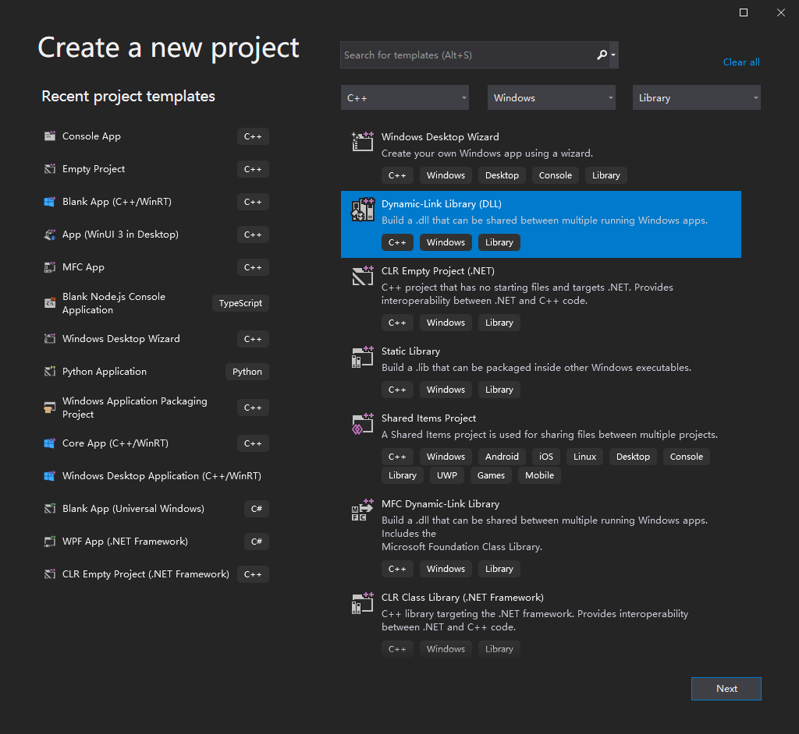

2. 在对话框的顶部，将语言设置为c++，将平台设置为Windows，  
并将项目类型设置为Library.

3. 从筛选的项目类型列表中，选择动态链接库(DLL)，
然后选择Next。

4. 在“Configure your new project”页面中，在项目名称”框中输入“CreateDLL”为项目指定一个名称。选择默认位置并将解决方案名称设置为 “dllTest”。如果选中了，则取消选中将解决方案和项目放在同一目录中。  

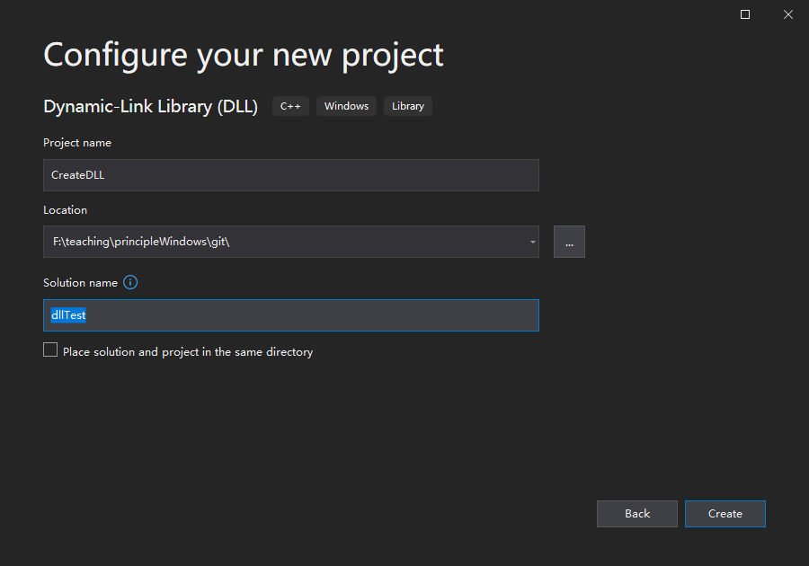

5. 选择Create按钮来创建解决方案和项目。在创建解决方案时，您可以在
Visual Studio中的“解决方案资源管理器”窗口查看。


目前，这个DLL并没有很多意义。接下来，创建一个头文件来声明DLL导出的函数，然后将函数定义添加到要创建的DLL中。

### 1.2 向DLL添加头文件

1. 创建函数的头文件：在菜单栏上，选择项目>添加新项目。

2. 在“添加新项目”对话框的左侧选择visualc++。选择头文件(.h)。指定' CreateDLL.h '作为头文件的名称。

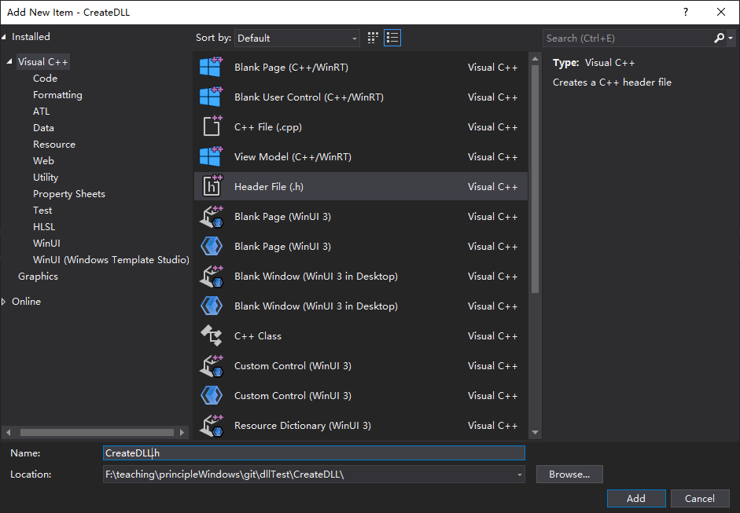

3. 选择Add按钮生成一个空白头文件，该头文件将显示在新的编辑器窗口。

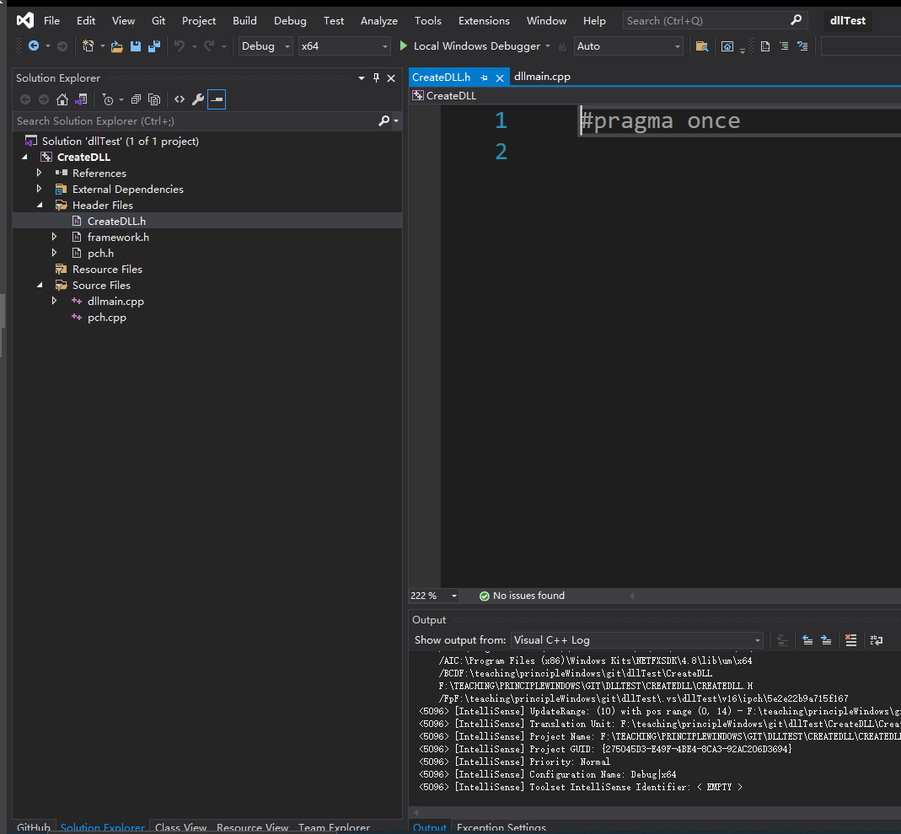

4. 用下面的代码替换头文件的内容:
```cpp
// CreateDLL.h - Contains declarations of unmanaged dll functions
#pragma once

#ifdef CREATEDLL_EXPORTS
#define CREATEDLL_API __declspec(dllexport)
#else
#define CREATEDLL_API __declspec(dllimport)
#endif

// 非托管动态链接库 DLL 的创建步骤:
// <1> 采用C++创建项目，项目类型为类库，名称为 CreateDLL

// <2> 在头文件中声明函数原型
extern "C" CREATEDLL_API int __stdcall testAdd (int a, int b);
extern "C" CREATEDLL_API int __stdcall testMulti (int a, int b);
```

注意文件顶部的预处理器语句的新项目模板，DLL项目将PROJECTNAME_EXPORTS添加到预定义的预处理器宏中。例如，当构建“CreateDLL”DLL项目时，Visual Studio定义了CREATEDLL_EXPORTS的新项目模板。DLL项目将PROJECTNAME_EXPORTS添加到预定义的预处理器宏中。  

定义 CREATEDLL_EXPORTS 宏时，CREATEDLL_EXPORTS_API 宏设置函数声明中的 `__declspec(dllexport)` 修饰符。 这个修饰符告诉编译器和链接器从 DLL 中导出函数或变量以供其他人使用应用程序。 当 CREATEDLL_EXPORTS 未定义时，例如，当头文件为由客户端应用程序包含，CREATEDLL_API 应用 __declspec(dllimport) 修饰符到声明。 此修饰符优化函数或变量的导入应用。 

右键单击项目名称`CreateDLL`并选择`Properties`打开`Property Pages`:

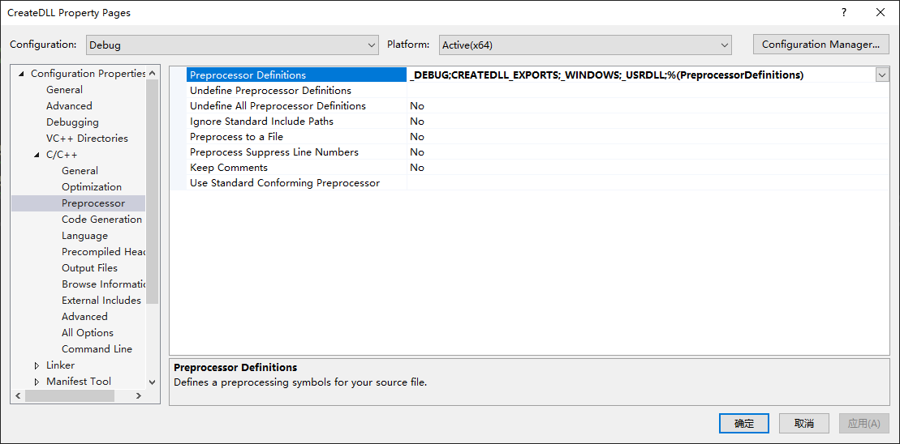

注意 CREATEDLL_EXPORTS 宏定义在 `Preprocessor Definitions`!


### 1.3 将实现添加到DLL中

1. 在解决方案资源管理器中，右键单击“源文件”节点并选择“添加”>“新项目”。创建一个名为 CreateDLL.cpp 的新 .cpp 文件。其方式与你在上一步中添加新头文件的方式相同。

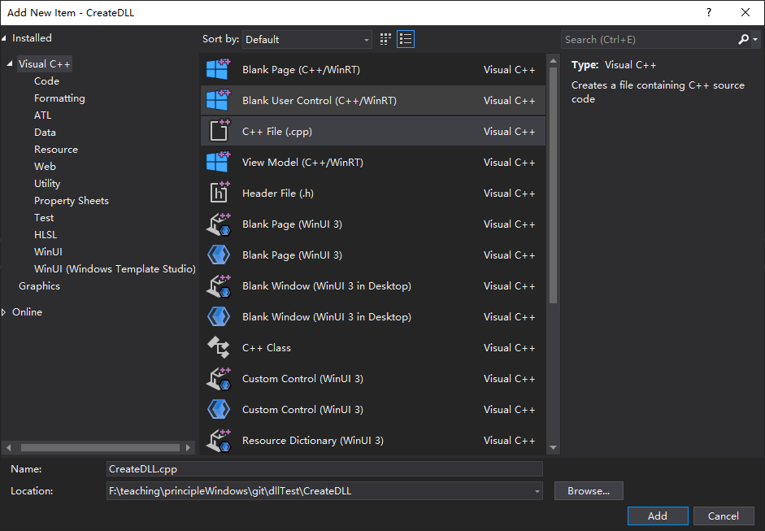

2. 在编辑器窗口中，选择 Create DLL.c++ 选项（如果它已经打开）。 如果没有，在解决方案资源管理器中双击，在CreateDLL项目的Source Files文件夹中创建DLL.cpp并打开它。

3. 在编辑器中，用以下代码替换CreateDLL.cpp文件的内容:  

```cpp
// CreateDLL.cpp : Defines the exported functions for the DLL.

// 非托管动态链接库DLL的创建步骤:
// <3> 在cpp源代码文件中引用头文件，并实现函数

#include "pch.h"
#include "CreateDLL.h"

int __stdcall testAdd( int a, int b )
{
	return	a + b;
}

int __stdcall testMulti( int a, int b )
{
	return	a * b;
}
```

要验证到目前为止一切正常，需要编译动态链接库。编译：在菜单栏上选择“构建>构建解决方案”。DLL和相关编译器输出放在解决方案文件夹下面的一个名为Debug的文件夹中。如果你创建一个发布版本时，输出放在名为Release的文件夹中。输出应该如下所示：

```batch
Build started...
1>------ Build started: Project: CreateDLL, Configuration: Debug x64 ------
1>Environment at start of build:
1>ALLUSERSPROFILE                = C:\ProgramData
1>APPDATA                        = C:\Users\jiche\AppData\Roaming
1>ChocolateyInstall              = C:\ProgramData\chocolatey
1>VisualStudioEdition            = Microsoft Visual Studio Community 2019
1>VisualStudioVersion            = 16.0
1>VSAPPIDNAME                    = devenv.exe
1>VSSKUEDITION                   = Community
1>windir                         = C:\WINDOWS
1>WIRESHARK_CYGWIN_INSTALL_PATH  = D:\cygwin64
1>WIRESHARK_LIB_DIR              = E:\teaching\networkDistributed\lab\wireshark-win64-libs-3.0
1>pch.cpp
1>CreateDLL.cpp
1>dllmain.cpp
1>Generating Code...
1>   Creating library F:\teaching\principleWindows\git\dllTest\x64\Debug\CreateDLL.lib and object F:\teaching\principleWindows\git\dllTest\x64\Debug\CreateDLL.exp
1>CreateDLL.vcxproj -> F:\teaching\principleWindows\git\dllTest\x64\Debug\CreateDLL.dll
========== Build: 1 succeeded, 0 failed, 0 up-to-date, 0 skipped ==========

```

祝贺你，你已经使用Visual Studio创建了一个DLL!接下来，将创建一个客户机使用DLL导出的函数的应用程序。

## 第二部分：创建使用DLL的c#客户端应用程序


### 2.1 在Visual Studio中创建一个客户端应用程序

1. 保持在第一部分中创建的解决方案处于打开状态。 在菜单栏上，选择“文件”>“新建”>“项目”以打开“创建新项目”对话框。

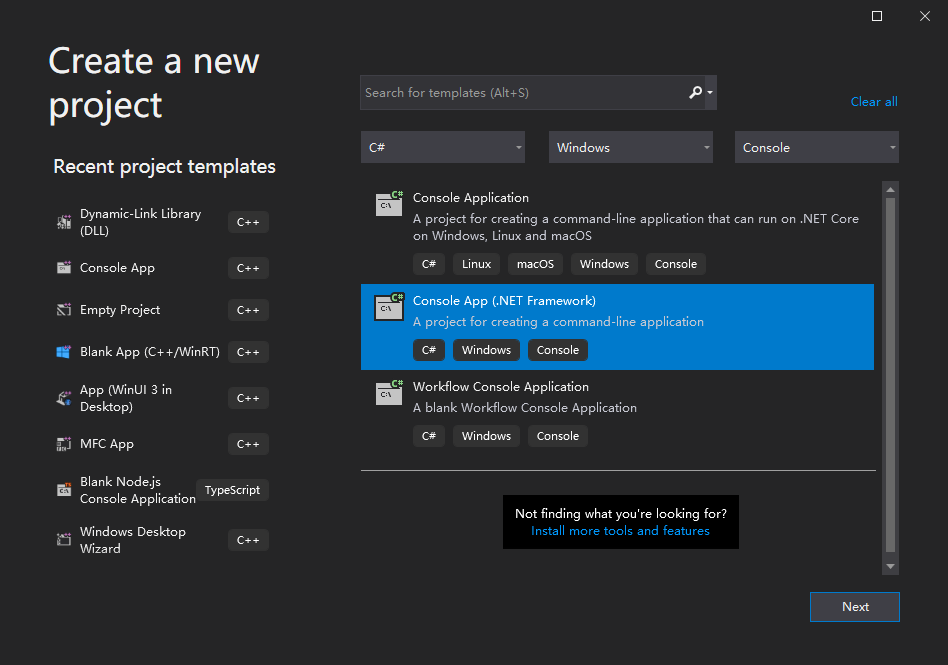

2. 在对话框的顶部，设置语言为c#，设置平台为Windows，并将项目类型设置为Console。

3. 从筛选的项目类型列表中，选择Console App(. NET Framework),然后选择Next。

4. 在“Configure your new project”页面中，在“项目名称”框中输入`TestDLL`为项目指定一个名称。选择默认位置并将解决方案设置为`Add to solution`。选择“框架”`.NET Framework 4.8`。

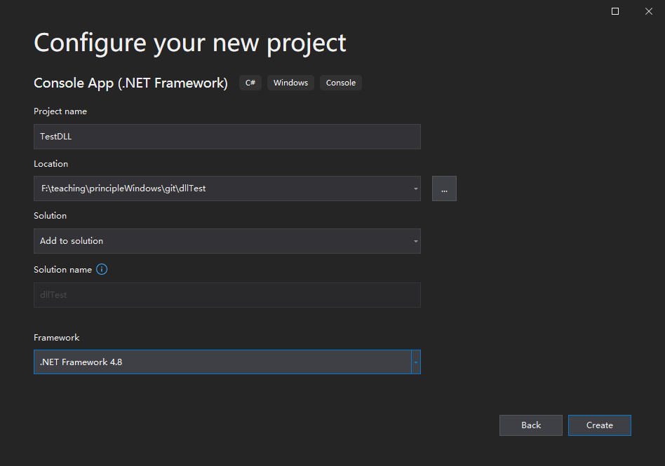

5. 选择Create按钮来创建项目并将其添加到当前解决方案中。  

在创建项目时，您可以在Visual Studio中的 `Solution Explorer`查看。

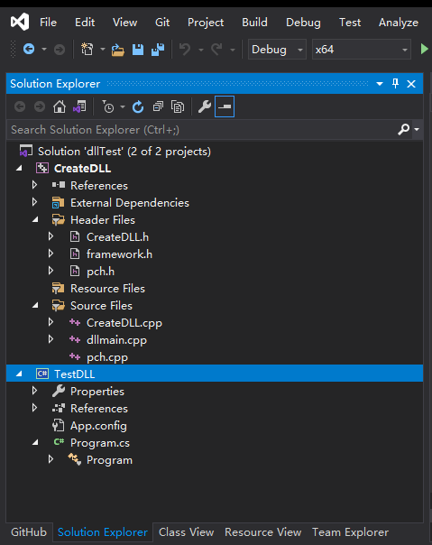

6. 右键单击项目的名称`TestDLL`，并将其设置为启动项目。  


### 2.2 添加c#类来声明所导入DLL的函数

1. 右键单击Solution Explorer中的 `TestDLL`, 在菜单栏上选择**add** > **Class...**，打开 `Add New Item`对话框.

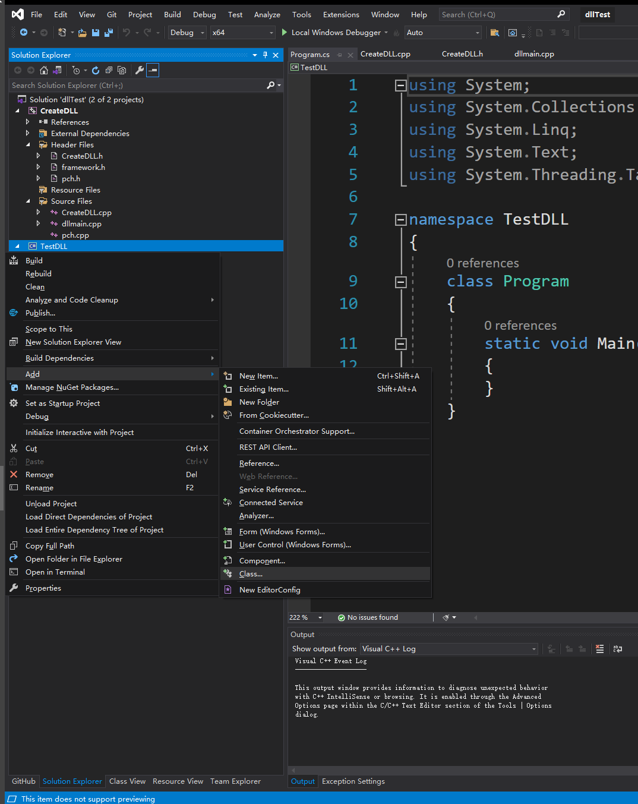

2. 选择 `Visual C# Items` ，选择 `Class`,输入编辑框的 `Name`：`DllTest.cs`.点击 `Add` 按钮创建一个名为 .cs的新文件 `DllTest.cs` 并添加到项目中。


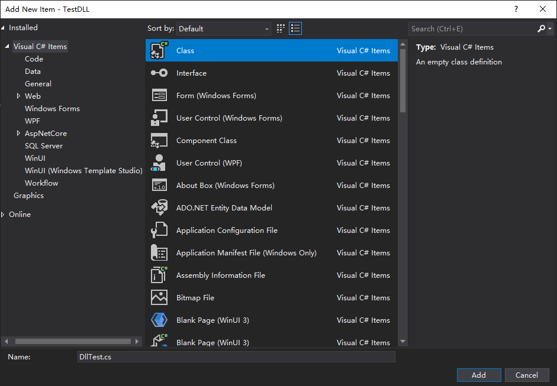

3. 在编辑器窗口中，选择' DllTest.cs '，如果它已经打开。如果没有打开,在“解决方案资源管理器”中，双击“源文件”文件夹中的“DllTest.cs”
打开它。

4. 在编辑器中，用以下代码替换' DllTest.cs '的内容：

```csharp
using System;
using System.Collections.Generic;
using System.Linq;
using System.Runtime.InteropServices;
using System.Text;
using System.Threading.Tasks;

namespace TestDLL
{
    class DllTest
    {
        // 非托管动态链接库DLL的调用过程:
        // <1> 采用DllImport动态加载动态链接库文件中的函数
        // <2> 重新声明
        [DllImport(@"dll_cpp.dll", EntryPoint = "testAdd", SetLastError = true, CharSet = CharSet.Ansi, ExactSpelling = false, CallingConvention = CallingConvention.StdCall)]
        public static extern int testAdd(int a, int b);

        // 非托管动态链接库DLL的调用过程:
        // <1> 采用DllImport动态加载动态链接库文件中的函数
        // <2> 重新声明
        [DllImport(@"dll_cpp.dll", EntryPoint = "testMulti", SetLastError = true, CharSet = CharSet.Ansi, ExactSpelling = false, CallingConvention = CallingConvention.StdCall)]
        public static extern int testMulti(int a, int b);
    }
}
```

### 2.3 使用声明的函数

现在可以使用[the last step](#to-add-a-c-class-to-declare-functions-of-the-imported-dll).声明的函数
用以下代码替换`Program.cs`的内容:

```csharp
using System;
using System.Collections.Generic;
using System.Linq;
using System.Text;
using System.Threading.Tasks;

namespace TestDLL
{
    class Program
    {
        static void Main(string[] args)
        {
            // 非托管动态链接库DLL的调用过程:
            // <3> 在程序中调用重新声明的函数
            int r1 = DllTest.testAdd(1, 2);

            int r2 = DllTest.testMulti(5, 2);

            Console.WriteLine("testAdd结果：" + r1.ToString());

            Console.WriteLine("testMulti结果：" + r2.ToString());

            Console.ReadKey();
        }
    }
}
```

您的客户端应用程序现在可以成功编译，但它仍然没有运行所需的一切。 当操作系统加载您的应用程序时，它会查找`CreateDLL.dll`。
如果在某些系统目录、环境路径或本地应用程序目录中找不到 DLL，则加载失败。 根据 VS 的版本，您将看到如下错误消息：

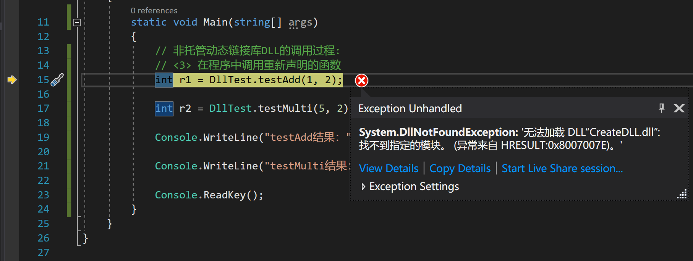

避免此问题的一种方法是将DLL复制到包含客户端可执行文件的目录中，作为构建过程的一部分。你可以向项目添加一个后生成事件，以添加一个将DLL复制到构建输出目录的命令。这里指定的命令只在DLL缺失或已更改时复制它。它使用宏来复制，根据你的构建配置，进出调试或发布位置。

### 2.4 在后生成事件中复制DLL

1. 右键单击“解决方案资源管理器”中的`TestDLL`节点，并选择Property,在编辑器窗口中打开.

2. 在左侧，选择Events > Post-Build Event。

3. 在property中，单击`Edit Post-build...`打开`Post-Build Event`命令行字段。输入这个命令:

xcopy /y /d "../../../x64\$(ConfigurationName)\CreateDLL.dll"

如果你的DLL和客户端项目在其他目录中，请将相对路径更改为匹配的DLL。

4. 将更改保存project properties.

现在，你的客户端应用程序拥有构建运行所需的一切。 通过在菜单栏上选择 Build > Build Solution 来构建应用程序。 根据你的 Visual Studio 版本，Visual Studio 中的输出窗口应具有类似于以下示例的内容：

```batch
Build started...
1>------ Build started: Project: CreateDLL, Configuration: Debug x64 ------
2>------ Build started: Project: TestDLL, Configuration: Debug Any CPU ------
2>  TestDLL -> F:\teaching\principleWindows\git\dllTest\TestDLL\bin\Debug\TestDLL.exe
2>  找不到文件 - CreateDLL.dll
2>  复制了 0 个文件
1>pch.cpp
1>CreateDLL.cpp
1>dllmain.cpp
1>Generating Code...
1>   Creating library F:\teaching\principleWindows\git\dllTest\x64\Debug\CreateDLL.lib and object F:\teaching\principleWindows\git\dllTest\x64\Debug\CreateDLL.exp
1>CreateDLL.vcxproj -> F:\teaching\principleWindows\git\dllTest\x64\Debug\CreateDLL.dll
========== Build: 1 succeeded, 1 failed, 0 up-to-date, 0 skipped ==========
```

有一个错误表明项目`TestDLL`无法找到项目`CreateDLL`生成的dll文件。
再次构建解决方案，错误就会消失，因为这次`CreateDLL.dll`已经在上次构建任务中构建了。

恭喜，你已经创建了一个调用 DLL 中函数的应用程序。现在运行你的应用程序以查看它的作用。 在菜单栏上，选择 Debug > Start Without Debugging. Visual Studio 打开一个命令窗口供程序运行。 最后一部分输出应如下所示：

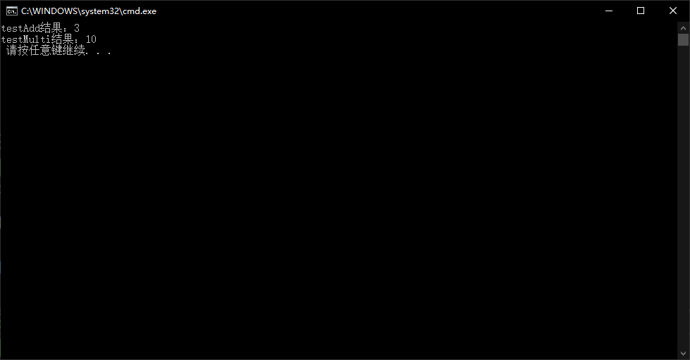

按任意键关闭命令窗口。


## 2.5 调试c#项目中的非托管c++ dll

现在你已经创建了一个 DLL 和一个客户端应用程序，你可以进行试验。 尝试在客户端应用程序的代码中设置断点，并在调试器中运行该应用程序。看看当你进入库调用时会发生什么。向库中添加其他函数，或编写另一个使用你的 DLL 的客户端应用程序。

但是此时如果在项目`CreateDLL`的代码中设置断点，则不会触发。 要从 C# 项目启用远程调试非托管 C++ dll，你可以通过设置“启用本机代码调试”的检查来设置C#项目的属性，如下所示：

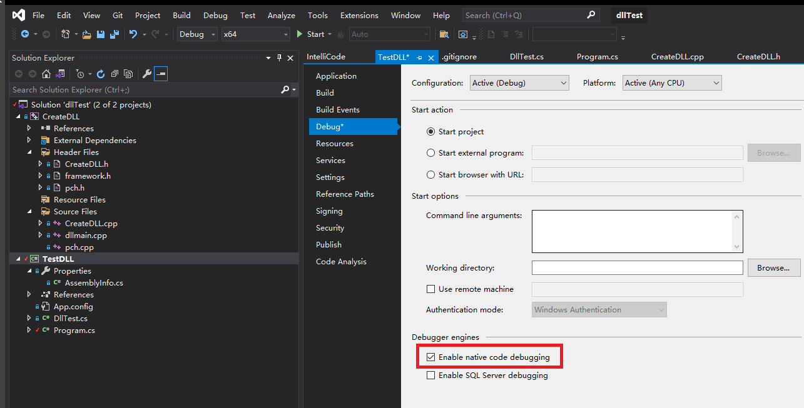

保存此设置并再次运行Debugging，在`CreateDLL`中设置的断点将会触发。
