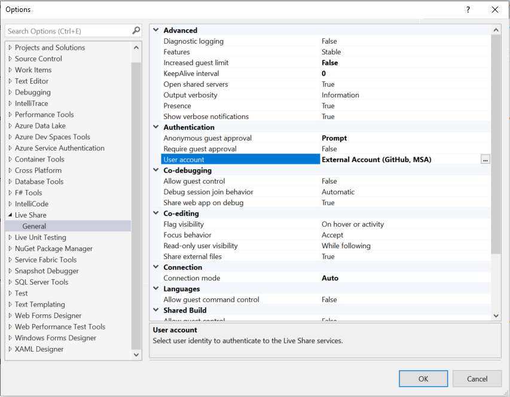

# 3.4 Collaborate using Visual Studio

[How-to: Collaborate using Visual Studio](https://docs.microsoft.com/en-us/visualstudio/liveshare/use/vs#share-a-terminal)

***

In this sub-lab we'll show you how to code collaboratedly by using some of the 
specific features in the Live Share extension for Visual Studio.

## 1 Installation

Visual Studio Live Share is installed by default with VS2019.

## 2 Sign in

In order to collaborate, you'll need sign into Visual Studio Live Share so 
everyone knows who you are. This is purely a security measure and does not opt 
you into any marketing or other research activities. You can sign in using a 
Microsoft personal account (e.g. @outlook.com), Microsoft-backed work or school 
account (AAD), or a GitHub account. Signing in is easy.

If you want to use a different sign-in than your Visual Studio personalization 
account, go to Tools > Options > Live Share > User account to switch credentials.

## 3 Share a project

Following the following steps to start a collaboration session and invite a 
collabrator account to work with you:

1. Use your normal workflow to open a folder, project, or solution you would like
    to share with your collabrator

2. [Optional] Update hidden or excluded files

By default, Live Share hides any files/folders referenced in .gitignore files 
in your project from guests. Hiding a file prevents it from appearing in the 
file tree while excluding it stops it from being transmitted even during 
operations like debugging. If you want to hide/exclude different files, 
a .vsls.json file can be added to your project with these settings. See 
[controlling file access and visibility](https://docs.microsoft.com/en-us/visualstudio/liveshare/reference/security#controlling-file-access-and-visibility) 
for details.

3. Start a collaboration session

Now, click the "Live Share" button in the upper right hand corner to start a 
Live Share session. A shareable link to your collaboration session is 
automatically copied to your clipboard.

4. [Optional] Enable read-only mode

Once you start your collaboration session, you can set the session to be read-only 
to prevent guests from making edits to the code being shared.

After sharing, you will get a notification that the invite link has been copied 
to your clipboard. You can then select the option to make the session read-only.

5. Send your collabrator the link of collaboration session

Send the link over e-mail, Slack, Skype, etc. to those you want to invite. Note 
that, given the level of access Live Share sessions can provide to guests, you 
should only share with people you trust and think through the implications of 
what you are sharing.

> Security Tip: Want to understand the security implications of some of Live 
Share's features? Check out the [security](https://docs.microsoft.com/en-us/visualstudio/liveshare/reference/security) 
article.

If the collabrator you invited has questions, the "[Quickstart: Join your first 
session](https://docs.microsoft.com/en-us/visualstudio/liveshare/quickstart/join)" 
article provides some more information on getting up and running as a guest.

6. 
