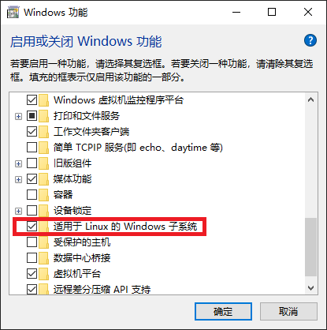
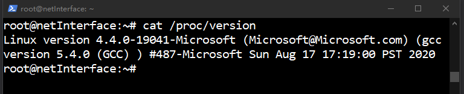
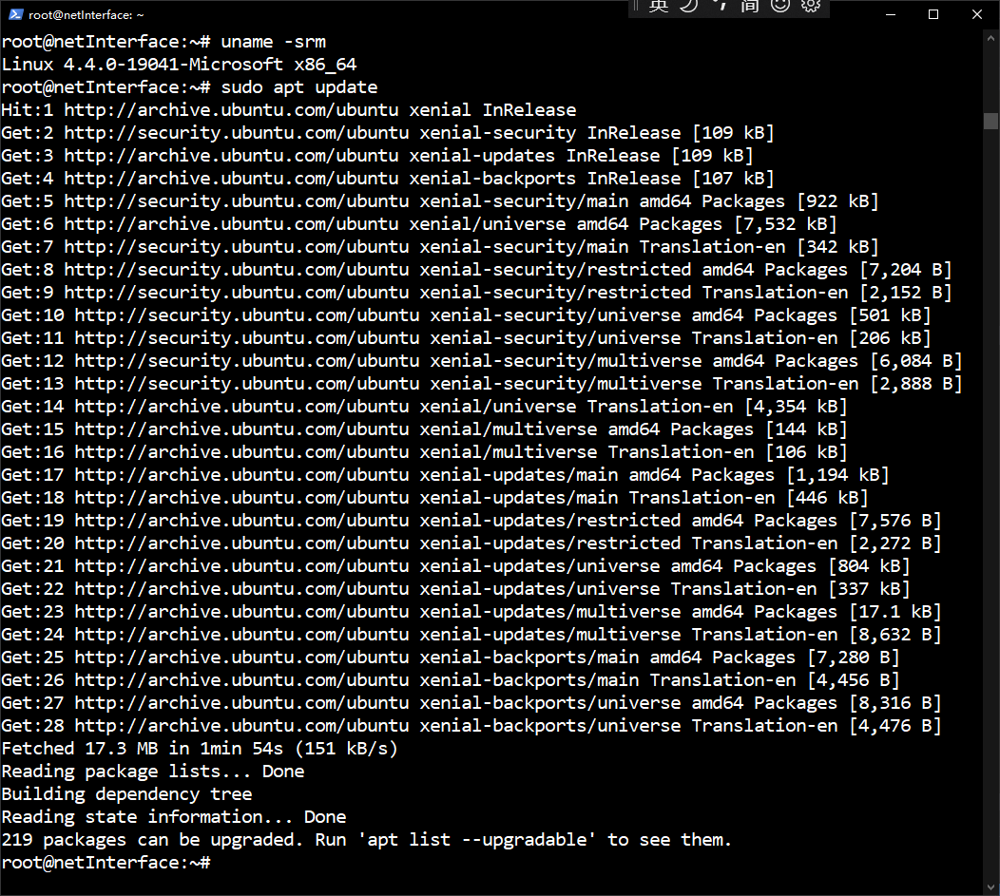

# WSL

93% of servers in the world are running on Linux. Linux systems are known to 
be very fast, reliable and secure. Software developers and system adminstrators 
love Linux because of its infinite customization possibilities, performance, 
and specialized tools that are not available on other systems.


## Index

1. [What is Windows Subsystem for Linux](#what-is-windows-subsystem-for-linux) \
    1.1 [WSL1 and WSL2](#wsl1-and-wsl2)
2. [Installation](#installation) \
    2.1 [Install WSL on Windows 11](#install-wsl-on-windows-11) \
    2.2 [Install WSL on Windows 10](#install-wsl-on-windows-10)
3. [Most-Used Linux Commands](#most-used-linux-commands)
4. [Basic commands for WSL](#basic-commands-for-wsl)


## 1 What is Windows Subsystem for Linux

Windows Subsystem for Linux (WSL), is a compatibility layer for running Linux 
binaries in Windows environment. It was first introduced by Microsoft in 
Windows 1607. It is now included by default in Windows installations, you just 
have to manually turn it on.

Above all, the WSL lets users and developers run a GNU/Linux environment. It 
including most command-line tools, utilities, and applications directly on 
Windows. They are unmodified, without the overhead of a traditional virtual 
machine or dualboot setup.

WSL or `C:\Windows\System32\wsl.exe` is a Windows tool that allows you to 
install a Linux distribution as an app from the Windows store. Since WSL is a 
simple Windows executable, you can call it from a cmd command prompt or 
PowerShell terminal.


### 1.1 WSL1 and WSL2

There are two different versions of Windows Subsystem for Linux, WSL1 and WSL2.

The original WSL is now known as WSL1. WSL1 provides a Linux-compatible kernel 
interface developed by Microsoft that allows a user to choose a Linux 
distribution to install from the Microsoft Store. WSL1 executes unmodified 
Linux ELF64 binaries by operating a Linux kernel interface on top of the Windows 
kernel in Windows 10. 

WSL2 is the latest version of WSL with new features. It was announced at 
Microsoft Build 2019. WSL2 features a Linux kernel running inside Windows 10 
and Windows 11 and is built on the core technology of Hyper-V to provide better 
Linux application support and improved file performance. WSL2 architecture is 
entirely different from WSL1. Unlike WSL1, which runs as a translation layer, 
the Windows subsystem for Linux 2 has a virtual machine with an actual Linux 
Kernel that can immediately react to system calls.

The main difference between them comes down to system call. In other words, 
WSL2 works a lot more like a traditional virtual machine (VM) where Windows 
would be the host and the WSL distro is the VM guest.

[Back to index](#index)


## 2 Installation


### 2.1 Install WSL on Windows 11

Run Command Prompt as administrator and type the following command:
```batch
wsl --install
```
After installation is completed you need to restart your computer to finish 
the WSL installation on Windows 11. Now, you can continue with the Linux 
distro setup as necessary. This will install automatically the latest 
version of the Ubuntu Linux.

If default Ubuntu is not to your liking, there is a separate command that 
allows you to specify a preferred Linux distro during WSL installation. 
Type the following command:
```batch
wsl --list --all
```
That will list all Linux distros available for download.

Find the distro you want to set up alongside WSL and type:
```batch
wsl --install -d [DISTRO-NAME]
```
Of course, you need to replace [DISTRO-NAME] with the name of the distro you 
want to install, for example, Debian.

Now, just hit the “Enter” key and wait for Windows 11 to install WSL and 
complete the process.

After installation is completed, restart your computer.

[Back to index](#index)


### 2.2 Install WSL on Windows 10

打开控制面板，选择程序和功能，点击“启用或关闭 Windows 功能”后出现如下
对话框：



勾选“适用于 Linux 的 Windows 子系统”后点击确定。

其后在更新和安全中勾选“开发人员模式”。

打开应用商店，搜索 Linux，选择安装 Ubuntu。

安装过程中你需要输入用户名和密码。

安装完成后查看一下版本：



然后进行一下更新，执行如下命令：
```shell
uname -srm
sudo apt update
```
效果如下：



当然这之前如果为了加快更新速度可以更换国内源，参见：
[Ubuntu: 更换国内源](https://www.jianshu.com/p/eb9bd6142c71)

[Back to index](#index)


## 3 Most-Used Linux Commands

更新：
```batch
sudo apt update && sudo apt upgrade
```


[Back to index](#index)


## 4 Basic commands for WSL

https://docs.microsoft.com/en-us/windows/wsl/basic-commands

************************************


[Back to index](#index)


